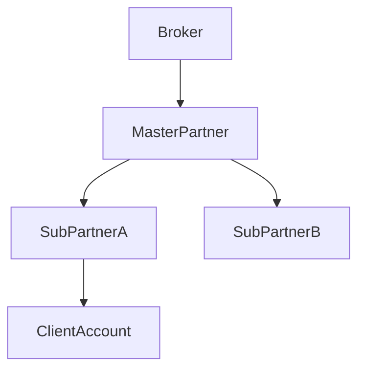
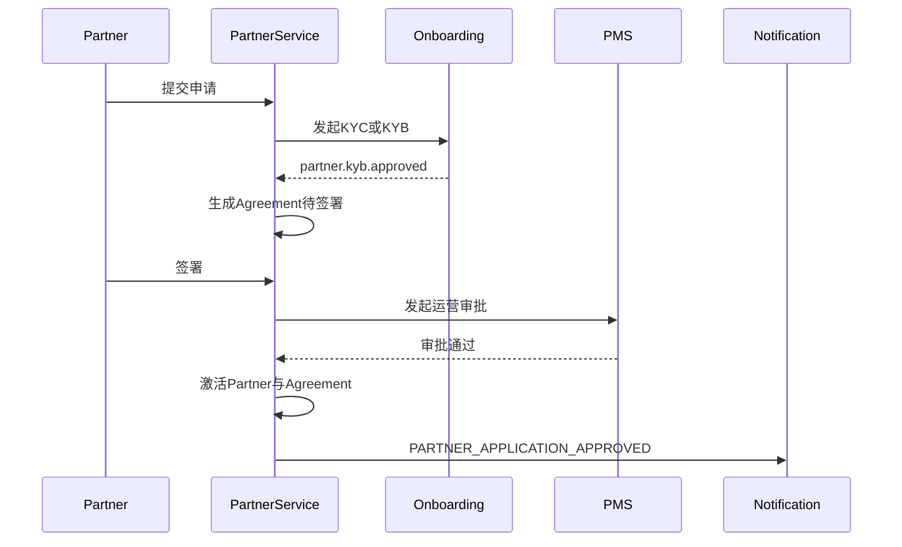
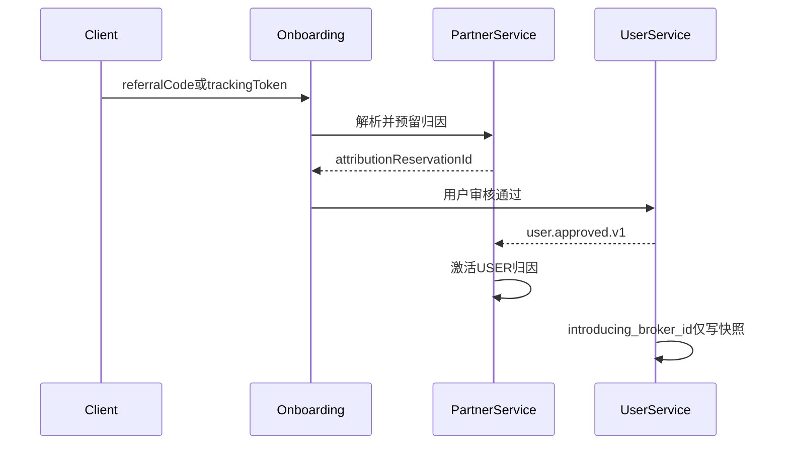
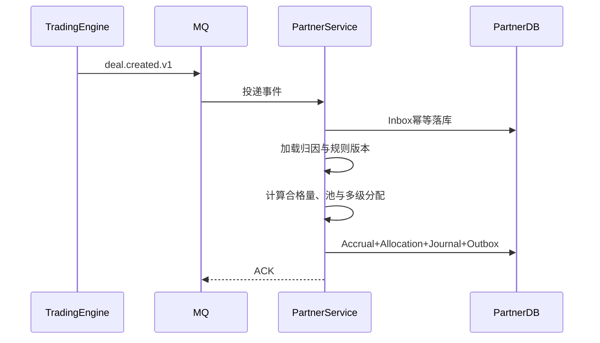

# 全球多资产代理商系统设计（Partner / IB Service）— 终版 v2.0

> 本文是代理商域的权威设计。它以现有准入、用户、账户、交易配置、通知、品种、权限、成交与资金体系为边界，不在代理域重复建立用户、KYC、交易账户、品种、客户收费或支付通道。

---

## 一、系统定位与关键决策

### 1.1 系统定位

Partner Service 是经纪平台的渠道合作伙伴管理、客户归因、奖励计算、佣金负债、结算与出款编排中心，支持：

- Introducing Broker（IB）：按客户交易活动持续返佣；
- Affiliate：按注册、合格开户、首存等转化事件支付 CPA；
- Regional / Institutional Partner：受法律实体、辖区和产品范围约束的机构渠道；
- Hybrid Partner：在同一计划中组合 CPA 与交易返佣。

以下概念不属于本系统：

- RIA、MAM、PAMM、基金经理属于账户体系的资管域；
- TradingView Broker Integration 属于外部交易入口和获客渠道，不等于多级 IB；
- Apex、DriveWealth 的 BaaS 以及 Broadridge、恒生的清算与账簿能力不是 IB 返佣引擎；
- 员工销售绩效、客户经理奖金属于企业激励系统（若落地见《营销与推荐系统设计》内部激励，**禁止**写入 Partner 佣金账本）；
- 客户交易手续费由 `t_account_group_commission` 决定，代理系统不得修改客户收费；
- **CRM 分群 / 客户经理 Desk / 投诉工单 / B2C 营销活动**属于《营销与推荐系统设计》，本域只提供渠道归因投影，不得被 CRM 改写 Attribution；发奖走资金契约，不进 IB/CPA 账本；
- **跟单 / 交易排行榜**属于《社交交易系统设计》；**社群 IM / 资讯**属于《内容与社区系统设计》；均不等于多级代理。

### 1.2 行业参考的正确使用方式

| 厂商/平台 | 可借鉴能力 | 不应误用的结论 |
|---|---|---|
| MetaQuotes MT5 | Group、Deal 粒度、Manager/API 集成、Agent 财务操作 | MT5 不是完整的外部多级代理 CRM |
| Spotware cTrader | Invite/归因、伙伴报表、交易平台开放集成 | 复杂多级合约与财务账簿仍需经纪商后台治理 |
| Devexperts DXtrade | 多资产佣金计划、开放集成、经纪后台生态 | DXtrade 本身不替代 Partner CRM、KYC 与支付 |
| Apex / DriveWealth | API-first、Partner/BaaS、合规开户和账簿边界 | Correspondent/Partner 不等于零售多级 IB |
| TradingView | Broker Integration、获客入口、Affiliate 归因窗口 | 不是券商内部返佣账本 |
| TT / Talos | 机构多场所、账户及执行透明度 | 不是零售渠道代理模型 |
| Broadridge / 恒生 | Books & Records、清算、审计、职责分离 | 不应把清算系统表结构照搬为 IB 层级 |

设计原则是吸收“可审计归因、版本化规则、可解释计算、账实相符、开放集成”，不虚构厂商产品能力。

### 1.3 十二项不可破坏的决策

1. `entity_id` 贯穿所有聚合根及财务/审计明细表，代理树不得跨法律实体；纯配置子表也必须经聚合根校验实体。
2. Partner 是 `t_user` 对应的个人或机构业务身份；KYC/KYB/AML 仍由 Onboarding 负责。
3. 代理域的版本化 Attribution 是客户归属唯一业务真相。
4. `t_user.introducing_broker_id` 仅为注册时快照，不参与历史佣金重算。
5. Partner Service 是佣金计提唯一写方；撮合引擎只发布成交事实。
6. 所有计算使用事件发生时的归因链、协议、规则、品种和汇率快照。
7. 多级返佣必须采用明确的累计差额或独立 Override 模型，禁止递归扣减“下级实得”。
8. 佣金不得超过规则定义的可分配池；CPA 使用营销预算池，交易返佣使用已实现收入池。
9. 业务计提、财务过账、结算单、可用余额和实际出款相互分离。
10. Partner 账本独立于交易账户 `t_account_ledger`，两者通过受控 Saga 转账。
11. 任何撤单、冲正、拒付、规则纠错都新增反向记录，禁止修改历史金额。
12. 配置发布、归属转移、人工调账、结算审批、出款审批满足四眼原则并完整审计。

---

## 二、边界与跨系统契约

### 2.1 领域边界

| 系统 | 权威数据 | Partner Service 的使用方式 |
|---|---|---|
| Onboarding | KYC/KYB、AML、协议签署证据 | 消费审核结果；发起 Partner 专属协议签署 |
| User | `user_id`、`entity_id`、适当性快照 | 引用主体；不得复制身份资料 |
| Account | 交易账户、账户组、客户收费规则 | 消费开户/激活；读取账户组和客户实收费用 |
| Symbol | category/group/symbol 主数据 | Commission Rule 只保存其 ID |
| Trading Engine | Order、Deal、Position 事实 | 只消费不可变成交/冲正事件 |
| Fund | 支付方式、支付通道、出款执行 | 通过 `PARTNER_WALLET` 来源类型发起出款 |
| Notification | 模板、偏好、通道与送达 | 只发布标准业务事件，不直连邮件/短信 |
| PMS | 员工 RBAC/ABAC/SoD 与审计 | 管理运营后台权限；Partner Portal 使用受限身份 |

### 2.2 关键事件

| 事件 | 生产方 | Partner Service 行为 |
|---|---|---|
| `user.approved.v1` | User/Onboarding | 校验待生效归因，不在此时擅自改派 |
| `account.opened.v1` | Account | 将 USER 级归因物化为 ACCOUNT 级归因 |
| `account.status_changed.v1`（`status: 0→1`） | Account | 账户由“待激活”迁移为“活跃”时更新转化里程碑；平台事件表**无**独立的 `account.activated.v1`，不得虚构监听该名称 |
| `deal.created.v1` | Trading | 交易奖励计提 |
| `deal.reversed.v1` | Trading | 对原计提生成全额或部分冲正 |
| `deposit.completed.v1` | Fund | 首存/入金 CPA 资格判断 |
| `deposit.chargeback.v1` | Fund | CPA 回拨与风险冻结 |
| `partner.payout.completed.v1` | Fund | 完成出款账务（补充卷 §4.3 已登记，生产方=资金域） |
| `partner.payout.failed.v1` | Fund | 释放或继续冻结出款金额（补充卷 §4.3 已登记，生产方=资金域） |

所有事件必须包含 `event_id`、`event_type`、`occurred_at`、`entity_id`、`aggregate_id`、`aggregate_version`、`correlation_id`、`payload`。生产方通过 Outbox/CDC 发布；消费方先写 Inbox，再执行业务事务。

### 2.3 跨域契约交付现状

以下曾是本域上线前必须由权威生产方补齐的契约，现状如下：

- **`deal.reversed.v1`**：已由《交易系统设计》交付（见 [10]交易系统/交易系统设计.md §三/§8.1），撮合引擎冲正场景下发布该事件，代理域可据此生成反向 Allocation。
- **`deposit.chargeback.v1`**：已由《资金系统设计》交付并在《平台跨域契约补充卷》§4.3 登记为“已登记”（见 [09]资金体系/资金系统设计.md §6.4/§7.4）。
- **Partner 通用出款**：Fund Service 已用 `t_payout_instruction`（见 [09]资金体系/资金系统设计.md §9.6）承载通用资金来源契约，`source_type` 覆盖 `CUSTOMER_WITHDRAWAL/PARTNER_WALLET/CHARGEBACK_REFUND`，代理域可直接携带 `partner_id` 创建该表记录发起出款，不需要改造 `t_withdrawal_order`（后者继续仅服务客户出金）。
- **`revenue.realized.v1`**：已由《路由网关设计》交付并在补充卷 §4.4 登记完整 Payload（`realized_markup_revenue`/`lp_execution_cost`/`distributable_revenue` 等），代理域 `NET_REVENUE_SHARE` 规则可直接消费，不得自行从持仓浮盈亏推算。
- **`user.approved.v1` / `account.opened.v1`**：《用户体系设计》已产出版本化事件并含 `introducing_broker_id`（快照字段）；《账户体系设计》已通过 Outbox 发布 `account.opened.v1`/`account.group_changed.v1`/`account.status_changed.v1`。

以上契约均已具备，Phase 1 单级 IB 上线不再存在阻断项（详见十三、MVP 与演进路线）。仍需留意的现状（非阻断，但影响实现细节）：

- `deal.created.v1.commission_amount` 语义为非负的客户手续费金额；`t_deal.commission` 字段在交易域内部仍以“负值表示扣费”存储（见 [10]交易系统/交易系统设计.md §9.4），事件适配层写出 `commission_amount` 时已取绝对值（见 [10] §3.4）。本域消费该字段时可直接使用，得到的非负值在本域记为 `customer_commission_received`（域内派生别名，非事件原始字段名），不得混用两者名称。
- Follower 跟单场景下 `source=SIGNAL` 与 `magic_number` 字段目前仍是交易域、量化域、社交交易域三方协同推进中的目标态（见 [13]跟单与排行系统/社交交易系统设计.md §3.2），本域 §5.8 的 Follower 计提规则按此现状表述，落地前退化为可验证的普通 Deal 单级计提。

所有生产方使用事务 Outbox，禁止依赖“写库成功后尽力发送 MQ”。

---

## 三、角色、生命周期与治理

### 3.1 核心角色

角色码遵循《平台跨域契约补充卷》§5.2/§5.3 唯一权威注册表，本域不得自创同义角色：

| 角色 | 平台角色码 | 职责 |
|---|---|---|
| Broker Operator | `PMS_IB_MANAGER` | 创建 Program、审核 Partner、发布规则 |
| Compliance Reviewer | `PMS_COMPLIANCE_REVIEWER` | KYB/AML 复核 |
| Compliance Officer | `PMS_COMPLIANCE_OFFICER` | 辖区与营销材料终审 |
| Partner Manager / Settlement Maker | `PMS_IB_MANAGER` | 维护协议与 Partner 关系、生成结算批次；不得审批自己发起的调账 |
| Settlement Checker | `PMS_IB_MANAGER` | 审批结算；SoD 由业务表 `maker_id != checker_id` 强制，不为此发明新角色码 |
| Finance Payout Approver | `PMS_IB_PAYOUT_APPROVER` | 审批出款；与 `PMS_IB_MANAGER` 互斥（补充卷 §5.2） |
| Partner Owner / Partner Staff | `BIZ_PARTNER` | 业务角色（补充卷 §5.3：代理域 IB/Affiliate）；查看自身及授权下级数据、发起出款 |
| Global Auditor | `PMS_AUDITOR` | 跨系统只读审计，不得修改业务数据 |

### 3.2 Partner 状态机

```text
DRAFT
  → PENDING_KYB
  → PENDING_AGREEMENT
  → PENDING_APPROVAL
  → ACTIVE
  → SUSPENDED → ACTIVE
  → TERMINATING → TERMINATED

任意审核阶段 → REJECTED
```

- `SUSPENDED`：禁止新增归因；既有计提按冻结策略进入 `HELD`。
- `TERMINATING`：禁止新增客户和下级；等待未决冲正、结算与保留金到期。
- `TERMINATED`：只读；历史关系、账本与审计永久保留。
- 状态恢复不得自动恢复已终止协议。

### 3.3 Program 与 Agreement

Program 是监管及产品边界，至少定义：

- 法律实体、允许辖区、Partner 类型、是否允许下级；
- 最大层级（建议 1–3，禁止默认无限层级）；
- 归因窗口、冷静期、结算周期、保留期和最低出款额；
- 分配模型、允许的奖励类型与预算池类型集合；
- 是否允许 Partner 自定义下级费率及其上下限。

Agreement 是 Partner 在特定 Program 下的版本化商务合同。已发布版本的业务内容不可原地修改；变更应创建新版本及未来 `effective_from`。发布未来版本时，调度事务允许且仅允许把旧版本的 `effective_to` 闭合到新版本的 `effective_from`，该生命周期元数据变更必须审批并审计。历史事件永远引用旧版本。

同一 Program 下所有 Agreement 必须使用 Program 的 `settlement_currency`，发布时强校验。这样同一 Accrual 的多级 Allocation 可在一个结算币种内求和与对账；不同 Program 仍可使用不同币种。

---

## 四、层级与唯一归因

### 4.1 层级模型

采用“版本化邻接边 + 闭包快照 + 当前指针”：

- 邻接边负责写入与历史；
- 闭包表负责查询祖先、后代和计算链；
- 每次层级发布生成 Program 级单调递增 `hierarchy_version`，该版本包含全树邻接边与完整 Closure 快照；
- 未来版本可以提前创建，但仅由 Program 级当前指针指向此刻已生效的全树版本；定时发布事务在所有快照写完后只切换一次指针；
- 移动子树必须串行加锁、检查环、检查最大深度和同实体；
- 已发生事件保存 `hierarchy_snapshot_json`，后续迁移不改历史佣金。



### 4.2 归因优先级

统一顺序：

1. 合规批准的管理员迁移；
2. 已存在且仍有效的 ACCOUNT 级归因；
3. 开户时从 USER 级归因物化；
4. 注册 Tracking Token；
5. 有效推荐码；
6. 无归因（ORGANIC）。

同一主体同一时刻只能有一个有效归因。未来归因可以预先创建，但在生效时才原子切换 Current Pointer。Cookie 只是证据，不是权威关系；推荐码先解析为 `campaign_id + partner_id`，再写 Attribution。Tracking Token 与设备匹配的点击证据留存在 `t_partner_channel_click_log`（见十、10.10，ClickHouse），仅供归因解析和渠道漏斗分析引用；`t_partner_attribution` 始终是唯一业务真相，点击日志本身不具备业务约束力。

所有时态区间采用半开区间 `[effective_from, effective_to)`。Agreement、Plan、Hierarchy、Attribution 发布时必须按业务键加悲观锁并检查区间不重叠；数据库普通 UNIQUE 不能替代区间重叠校验。

### 4.3 归因变更规则

- 默认不允许 Partner 自助抢客或迁移客户。
- 管理员迁移必须提供 reason、证据、审批单及 `effective_from`。
- 迁移只影响生效时间之后的新事件，禁止追溯改写历史。
- 同一 `deal_id` 必须使用成交时已固化的 Attribution。
- USER 级归因与 ACCOUNT 级归因冲突时，ACCOUNT 级生效；`t_user.introducing_broker_id` 不参与裁决。

### 4.4 与营销域归因冲突的升级流程

营销域**不得**直接改写 Attribution（补充卷 §五越界禁令）。CRM 请求改派客户归因必须走跨域审批工单：

```text
CRM 申请改派 Attribution
  → 提交工单（营销域）
  → 代理域审核（PMS_IB_MANAGER）
  → 若同意改派：
      1. 旧 Attribution status=SUPERSEDED
      2. 新 Attribution 生效（记录 superseded_by）
      3. 已计提佣金不回溯（避免账本混乱）
      4. 新成交按新 Attribution 计提
  → 若拒绝：工单关闭，记录审计
```

---

## 五、佣金计划与确定性算法

### 5.1 奖励类型

| reward_type | 基础 | 适用场景 |
|---|---|---|
| `PER_LOT` | 合格成交手数 | FX/CFD |
| `PER_DEAL` | 合格成交笔数 | 固定交易奖励 |
| `NOTIONAL_BPS` | 成交名义金额 | 证券/数字资产 |
| `COMMISSION_SHARE` | 客户实际支付佣金 | ECN/证券 |
| `NET_REVENUE_SHARE` | 已实现可分配净收入 | 点差/Markup 分成 |
| `QUALIFIED_ACCOUNT_CPA` | 合格开户里程碑 | Affiliate |
| `FIRST_DEPOSIT_CPA` | 合格首存里程碑 | Affiliate |
| `FIXED_OVERRIDE` | 下级活动的固定额/比例 | Master IB |

“按客户盈亏任意分成”默认不支持：它难以形成稳定、可解释、可监管的收入基础。若业务确需该模式，应由独立 Revenue Event 提供已实现、可审计的 broker revenue，而不是从持仓浮盈亏推算。

### 5.2 Scope 匹配

规则匹配优先级从高到低：

1. `symbol_id`
2. `symbol_group_id`
3. `symbol_category_id`
4. `account_group_id`
5. Program 默认

同优先级按 `priority DESC, id ASC` 决胜。禁止用自由文本 `symbol_category` 与品种树模糊匹配。

### 5.3 合格量

`qualified_volume` 必须显式定义：

- 开仓、平仓或双边是否计奖；
- 部分成交按 Deal 实际量；
- Demo 账户默认永不计提；内部对倒、自成交、异常超短持仓、Bonus 账户按 Program 明确排除；
- `contract_size` 与 lot 换算使用成交时品种规格快照；
- 撤单不产生 Deal；Deal 冲正生成反向计提；
- CPA 必须满足 KYC、最小净入金、保留天数、无拒付等资格。

### 5.4 可分配池

交易返佣的可分配池：

```text
total_distributable_pool
  = customer_commission_received                    # deal.created.v1.commission_amount 取绝对值
  + revenue.realized.v1.distributable_revenue        # 路由网关已扣减 lp_execution_cost/exchange_and_regulatory_fees/non_shareable_tax 后的净点差收入，直接消费不再重算
```

> **命名说明**：`total_distributable_pool` 是本域佣金规则引用的可分配池总额，不等同于 `revenue.realized.v1` 事件里的 `distributable_revenue` 字段（后者只是点差收入分量，权威在路由网关，见补充卷 §4.4）。本域不重复推算 `realized_markup_revenue - lp_execution_cost - exchange_and_regulatory_fees - non_shareable_tax`，直接消费事件已算好的 `distributable_revenue` 字段，避免与路由网关的口径产生二次偏差。

若事件无法提供可靠收入拆分，则该规则只能使用固定 `PER_LOT/PER_DEAL/NOTIONAL_BPS` 且受 Program 预算上限约束，不得猜测点差收入。

其中 `customer_commission_received` 始终为非负标准化金额；不得直接把交易表中“负数表示扣费”的 `commission` 字段代入公式。

CPA 使用独立 `MARKETING_BUDGET`，不与单笔客户交易费用强行绑定。

预算池类型不放在 Program 或 Plan 的单值字段中，而由每条 Rule 引用的 Budget Pool 决定：交易奖励只能引用 `DISTRIBUTABLE_REVENUE`，CPA 只能引用 `MARKETING_BUDGET`。因此 Hybrid Plan 可以安全组合两类规则。

### 5.5 多级累计差额模型

设归因链由近到远为 `P0, P1, ... Pn`，合格数量为 `Q`，每一级同量纲累计权益费率为 `E0 <= E1 <= ... <= En`：

```text
allocation(P0) = E0 × Q
allocation(Pi) = (Ei - E(i-1)) × Q, i > 0
total          = En × Q
```

示例：直属 Partner C 权益 `$3/lot`，上级 B 为 `$5/lot`，根 A 为 `$8/lot`：

```text
C = 3 × 1 = 3
B = (5 - 3) × 1 = 2
A = (8 - 5) × 1 = 3
合计 = 8 USD
```

绝对禁止以下错误：

```text
A = 8 - B的实得2 = 6
```

该错误会在三级以上导致超池（十五、明确不做与常见误区 §1 有反例说明）。

约束：

- 每一级累计权益必须单调不减；
- 先将权益、数量和收入池转换到 Program 结算币种，再校验 `total <= min(plan_cap_amount, distributable_pool_amount)`；比例上限则校验 `total <= distributable_pool_amount × plan_cap_value`；
- 金额先以高精度计算，最后一级吸收舍入差；
- 任一负差额使整个事件进入 `CALCULATION_ERROR`，不得静默置零。

### 5.6 独立 Override 模型

`FIXED_OVERRIDE` 中每一级配置独立奖励：

```text
total = direct_reward + Σ override_i
```

系统在发布时验证总上限。一个 Plan Version 只能选择 `CUMULATIVE_DELTA` 或 `FIXED_OVERRIDE`，禁止混用以免解释歧义。

### 5.7 阶梯与期末调差

- `PROGRESSIVE`：不同区间分别计价；
- `RETROACTIVE`：达到新档后全周期按新档，期末生成差额 Adjustment；
- 周期内先按当前已达档计提，不修改旧行；
- 迟到事件进入原业务周期，并在已关账时生成下一期调整；
- Tier 统计按 Program 指定的 UTC/法律实体时区执行。

### 5.8 跟单 Follower Deal 计提规则

Follower 通过社交交易域发起的跟单成交，在计提侧遵循：

- Follower Deal 的 `source=SIGNAL`、`magic_number=subscription.magic_number`（字段现状见 [13]跟单与排行系统/社交交易系统设计.md §3.2：交易域 `t_order`/`t_deal` 尚未落地 `SIGNAL` 枚举与 `magic_number` 字段，属交易域、量化域、社交交易域三方协同推进中的目标态；落地前退化为普通 `CLIENT` Deal 单级计提）；
- **是否计入 IB 合格量**：由 `t_commission_plan_version.follower_eligible` 字段控制（默认 `true`）；
- **归因穿透**：Follower 账户自身的 `t_partner_attribution` 为权威，不因跟单关系穿透到信号源/Master 的 IB；
- **Master IB 与 Follower IB**：两者若不同，分别按各自归因链独立计提，互不影响、互不折算。

### 5.9 幂等、冲正与补算

幂等键：

```text
(entity_id, source_producer, source_event_id, plan_version_id)
(accrual_id, beneficiary_partner_id, rule_version_id)
```

冲正遵循：

- 查找原 `source_event_id`；
- 按原归因、原规则、原汇率生成负数 Allocation；
- 已结算则形成负应付或 Clawback，不删除原结算；
- 部分冲正按原始数量比例，累计冲正不得超过原金额；
- 补算必须记录 `calculation_run_id`、原因、发起人与审批人。

---

## 六、计提、账务、结算与出款

### 6.1 分层模型


- Accrual：业务上“为什么应付”；
- Allocation：每个受益 Partner 应得多少；
- Journal：平台佣金负债的会计事实；
- Settlement：一个周期内经审核的应付对账单；
- Payout：实际资金出款编排。

### 6.2 Allocation 生命周期

```text
PENDING → ELIGIBLE → PAYABLE → PAID
              ↕          ↕
             HELD ←──────┘
   └──────────────→ REVERSED
   └──────────────→ REJECTED
```

- `PENDING`：已计算，尚在资格/冷静期；
- `ELIGIBLE`：资格满足，可进入结算；
- `HELD`：合规、风险、争议或保留金冻结；
- `PAYABLE`：结算批准并形成应付；
- `PAID`：Fund 确认出款完成；
- `REVERSED`：通过反向分录冲销，原记录不改金额。

每次进入或离开 `HELD` 都必须生成独立 `HOLD/RELEASE` Journal，并以风险 Case 或审批单作为幂等业务键。冻结解除后按冻结前阶段回到 `ELIGIBLE` 或 `PAYABLE`。

### 6.3 Partner 账本

采用按币种平衡的双分录日志：

- `PARTNER_PAYABLE:{partner_id}`：平台对 Partner 的负债；
- `PARTNER_AVAILABLE:{partner_id}`：可申请出款；
- `PARTNER_HELD:{partner_id}`：保留金/风险冻结；
- `PAYOUT_CLEARING`：出款清算；
- `COMMISSION_EXPENSE` / `MARKETING_EXPENSE`：平台费用科目；
- 每个 Journal 的借贷绝对值之和必须相等且币种一致。

`t_partner.wallet_balance` 之类可变余额不再作为真相。余额由 Entry 汇总或可靠投影生成；投影可重建。

### 6.4 多币种

- 计提保存原始币种、结算币种、汇率、汇率源和时间；
- 同一 Program 的所有 Partner 使用相同结算币种；Accrual 总额与 Allocation `gross_amount/net_amount` 均以该币种表达；
- Allocation 另存 `source_base_amount/source_currency`，保留转换前依据；
- 固定金额按 Rule Currency 计算，再转换为 Agreement Settlement Currency；
- 不允许在同一 Journal 内跨币种借贷；换汇拆成两个平衡 Journal，并通过 `fx_conversion_id` 关联；
- 舍入差进入 `FX_ROUNDING` 科目，不归某级 Partner 随意吸收。

### 6.5 结算

结算批次按 `entity_id + program_id + period + currency` 生成：

```text
DRAFT → CALCULATED → PENDING_APPROVAL → APPROVED → POSTED
                                      → REJECTED
POSTED → PARTIALLY_PAID → PAID
```

- 生成时锁定符合条件的 Allocation；
- 计算/审批阶段使用可过期的 Settlement Claim 临时认领，不创建最终 Item；
- 重新运行同一周期必须命中唯一键并复用批次；
- Maker 与 Checker 不得相同；
- 审批后通过 Journal 将负债转入 Available；
- 只有 POSTED 时才将 Claim 转为全局唯一 Settlement Item；REJECTED/CANCELLED 必须原子释放 Claim，使来源可进入后续批次；
- 结算单保存行项目、税费、保留金、调整、期初/期末余额；
- 已 POSTED 批次不得修改，只能在后续周期调整。

### 6.6 出款与转交易账户

Partner Service 不自建 PSP 通道。它直接携带 `partner_id` 向 Fund Service 的统一出款指令表 `t_payout_instruction`（见 [09]资金体系/资金系统设计.md §9.6）创建记录：

```json
{
  "entity_id": "entity_id",
  "source_type": "PARTNER_WALLET",
  "source_id": "partner_payout_id",
  "partner_id": "partner_id",
  "channel_id": "channel_id",
  "target_snapshot": "{...出款目标快照JSON,如银行卡/钱包地址...}",
  "amount": "1000.00",
  "currency": "USD",
  "payment_method_id": "xxx",
  "idempotency_key": "partner_payout_no"
}
```

> 字段名与 [09]资金体系/资金系统设计.md §9.6 `t_payout_instruction` 的列名一一对应（snake_case，非 camelCase）；`target_snapshot` 为该表 NOT NULL 必填字段，不可省略。

`t_payout_instruction` 已是客户出金（`CUSTOMER_WITHDRAWAL`）与 Partner 出款（`PARTNER_WALLET`）共用的通用适配器，`source_type` 互斥，不能伪造交易账户 ID；幂等范围为 `(entity_id, idempotency_key)`。`t_partner_payout.fund_order_id/fund_order_no` 对应 `t_payout_instruction.id/instruction_no`；PSP reference 另存于 `t_payout_instruction.psp_order_id`，不得混用。

出款 Saga：

1. Partner Service 校验 Available、KYC/KYB、最低金额、支付方式和风险；
2. `PAYOUT_RESERVE` Journal：Available → Payout Clearing；
3. 创建 `t_partner_payout` 并向 Fund 创建 `t_payout_instruction`；
4. Fund 回调 `partner.payout.completed.v1`：`PAYOUT_COMPLETE` Journal 将 Clearing → Cash/External Settlement，Payout=COMPLETED；
5. Fund 回调 `partner.payout.failed.v1`（补充卷 §4.3 已登记，见二、2.2）：`PAYOUT_RELEASE` Journal 将 Clearing → Available，Payout=FAILED；
6. 超时保持 PROCESSING，由对账任务查询 `t_payout_instruction.status`，禁止直接重复出款。

**Fund 回调超时处理**：

```text
Payout 发起 → t_payout_instruction(status=SUBMITTED)，同步 t_partner_payout.status=PROCESSING（等待 Fund 回调）
  → 超时 24h 无响应：
      1. t_partner_payout.status → RECONCILE（t_payout_instruction 仍停留在 SUBMITTED）
      2. 告警 P1
      3. 人工核对 t_payout_instruction 实际状态
      4. Fund 确认已出款(t_payout_instruction.status=SUCCEEDED) → t_partner_payout.status=COMPLETED
      5. Fund 确认未出款(t_payout_instruction.status=FAILED/CANCELLED) → RELEASE（释放锁定金额，t_partner_payout.status=FAILED）
  → Fund 回调成功 → t_partner_payout.status=COMPLETED
  → Fund 回调失败 → RELEASE（t_partner_payout.status=FAILED）
```

监控：`payout_stuck_in_processing` > 0 告警。

出款按 FIFO（最早 POSTED Settlement 优先）或用户明确指定结算单进行核销，写入 Payout Application。创建时必须锁定 Settlement 并原子增加 `reserved_amount/version`，确保所有有效 Application 累计不超过未付金额；失败释放 Reserved，成功转入 Paid。Application 金额合计必须等于 Payout 金额；回调成功后据此推进 Settlement 的 `PARTIALLY_PAID/PAID` 与对应 Allocation 的 `PAID`。

转入本人交易账户也是跨账本 Saga：

- Partner 账本先 Available → Transfer Clearing；
- Account/Fund 通过 `t_account_ledger(ledger_type=15-PARTNER_TRANSFER)` 入交易账户（专用类型，与普通账户间转账 `12-TRANSFER_IN` 区分，见 [09]资金体系/资金系统设计.md §9.11）；
- 成功后关闭 Clearing，失败则补偿回 Available；
- 仅允许同一 `user_id`、`entity_id`、兼容币种与有效账户。

### 6.7 税务预扣

- 代理商税务档案见 `t_partner_tax_profile`（十、10.9）：`partner_id`、`jurisdiction`、`tax_type`（WHT/VAT）、`rate`、`threshold_amount`；
- 计提时按 jurisdiction 预扣预提所得税（WHT），写入 `t_commission_accrual.tax_amount` 或对应 `t_commission_adjustment`；
- 结算时净额 = 计提 - 税；
- 报表：年度税务申报表，供 Partner 报税。

### 6.8 对账

每日执行：

- Inbox 事件数 vs 已处理/失败数；
- Deal/Deposit 事实 vs Accrual；
- Accrual 总额 vs Allocation 总额；
- Allocation vs Journal；
- Journal 借贷平衡；
- Settlement Item vs PAYABLE Allocation；
- Payout Clearing vs Fund 状态；
- 账本投影余额 vs Entry 重算余额。

差异只生成 Reconciliation Case，禁止自动改历史金额。

---

## 七、风控、合规与隐私

### 7.1 风险规则

| 风险 | 处置 |
|---|---|
| Partner 与客户同设备/IP/支付工具 | HOLD + 人工调查 |
| 关联账户对倒或极短持仓刷量 | 排除合格量或延长保留期 |
| 首存后快速退款/拒付 | CPA 反向计提、Partner 冻结 |
| 同客户重复注册/跨 Partner 洗归因 | 保留首个有效归因并建 Case |
| 异常返佣率高于收入 | 阻止 Rule 发布或事件进入错误队列 |
| 跨禁售辖区招揽 | 拒绝归因、暂停 Campaign |
| Partner 负余额持续扩大 | 停止新结算并进入追偿 |

风险决定必须保存 `rule_code`、证据、命中时间、处置和人工复核结果。

### 7.2 合规

- Partner 自身必须完成 KYC/KYB、AML、制裁与 PEP 筛查；
- Program 配置允许国家、禁止国家、客户类型和营销材料审批；
- 不允许用多层结构规避牌照、招揽或传销限制；
- 税务信息和预扣税在 Settlement 中单列；
- 合同、计算解释、审批、账本和出款证据按实体政策归档；
- PII 不复制到代理库，报表默认脱敏；Partner 只能查看被归因客户的最小必要信息。

---

## 八、权限、通知与报表

### 8.1 PMS 权限点

| 权限点 | 数据范围 | 角色码 | SoD |
|---|---|---|---|
| `partner.program.read/write/publish` | ENTITY | `PMS_IB_MANAGER` | 发布需双人审批 |
| `partner.profile.review` | ENTITY | `PMS_IB_MANAGER` | 不得审核本人创建的 Partner |
| `partner.hierarchy.transfer` | ENTITY | `PMS_IB_MANAGER` | 必须独立审批 |
| `partner.agreement.write/publish` | ENTITY | `PMS_IB_MANAGER` | 发布后不可改 |
| `partner.attribution.transfer` | ENTITY | `PMS_IB_MANAGER` | 必须有原因与证据 |
| `partner.commission.recalculate` | ENTITY | `PMS_IB_MANAGER` | 只生成差额 |
| `partner.adjustment.create/approve` | ENTITY | `PMS_IB_MANAGER` | Maker/Checker（`actor_id` 不同） |
| `partner.settlement.create/approve` | ENTITY | `PMS_IB_MANAGER` | Maker/Checker（`actor_id` 不同） |
| `partner.payout.approve` | ENTITY | `PMS_IB_PAYOUT_APPROVER` | 与 `PMS_IB_MANAGER` 互斥（补充卷 §5.2） |
| `partner.audit.read` | ENTITY/ALL | `PMS_AUDITOR` | 只读 |

Partner Portal 仅允许 `SELF` 与授权的 `DESCENDANTS` 范围（业务角色 `BIZ_PARTNER`，补充卷 §5.3），并应用列级脱敏。

现有 PMS 的 `ALL/ORG_TREE/TEAM/SELF/CUSTOM` 不直接表达 Partner 子树：券商员工后台仍由 PMS 按 ENTITY/CUSTOM 授权；Partner Portal 的 `DESCENDANTS` 由 Partner Service 使用当前 `hierarchy_version + closure` 做业务行级鉴权，不把代理树伪装成 PMS 组织树。代理域 Partner Portal 权限不直接用 PMS 角色，而由代理域自定义 `PARTNER_NETWORK` scope provider（权限域 §4.6），不复制层级数据。

### 8.2 通知事件

复用 Notification Service。现有权威字典中的 `IB_NEW_CLIENT`、`IB_COMMISSION_SETTLED`、`IB_WITHDRAWAL_COMPLETED` 保持兼容；以下 `PARTNER_*` 是拟新增模板，必须先同步登记到通知系统模板字典后才能发布：

- `PARTNER_APPLICATION_APPROVED/REJECTED`
- `PARTNER_AGREEMENT_EFFECTIVE/EXPIRING`
- `IB_NEW_CLIENT`
- `PARTNER_COMMISSION_ACCRUED`
- `IB_COMMISSION_SETTLED`
- `PARTNER_COMMISSION_REVERSED`
- `PARTNER_ACCOUNT_HELD/RELEASED`
- `PARTNER_PAYOUT_SUBMITTED/COMPLETED/FAILED`（其中 COMPLETED 兼容映射 `IB_WITHDRAWAL_COMPLETED`）

资金和合规类消息不可退订；计提明细可按日摘要，避免逐 Deal 轰炸。

### 8.3 报表口径

- 实时看板：注册、KYC、开户、激活、首存、活跃客户、成交量、预计佣金；
- 佣金报表：按 Program/Partner/客户/账户/品种/Rule/周期；
- 财务报表：Pending、Held、Payable、Paid、Clawback、负余额；
- 转化漏斗：Click → Registration → KYC → Account → First Deposit → Active；
- 风险报表：关联账户、自成交、拒付、异常返佣率、跨区流量；
- 对账报表：事件、计提、账本、结算、Fund Payout 差异。

**读模型**：写模型（`t_commission_accrual`/`t_partner_journal` 等 OLTP）与查询分离，Partner Portal 与看板查询走物化视图 `mv_partner_daily_summary`（按 `partner_id × day` 聚合，5 分钟刷新）与 ClickHouse T+1 投影，避免压 OLTP。

**渠道分析**：渠道 ROI、转化漏斗分析基于 `t_partner_channel_click_log`（十、10.10）与 `t_partner_campaign` 关联统计，属分析型数据，不影响归因判定。

“预计佣金”与“可出款余额”必须在 UI 明确区分。

---

## 九、核心流程

### 9.1 Partner 入驻



### 9.2 注册归因



### 9.3 成交计提



### 9.4 冲正

```text
deal.reversed
  → Inbox 幂等
  → 查原 Accrual/Allocation
  → 使用原快照生成负 Allocation
  → 未结算：抵减待结算
  → 已结算：形成负应付/Clawback
  → 发布 PARTNER_COMMISSION_REVERSED
```

---

## 十、数据库设计（MySQL 8）

### 10.1 通用约定

- 主键 `BIGINT UNSIGNED`，对外编号 `VARCHAR(64)`；
- 金额 `DECIMAL(24,8)`，费率 `DECIMAL(18,10)`，数量 `DECIMAL(24,8)`；
- 时间 `DATETIME(3)`，存 UTC；
- 状态和类型使用可读 `VARCHAR`；
- 不跨库建物理外键，由应用层与对账任务保证；
- 财务、事件、审计表只追加；分区由自动化任务滚动创建；
- 配置使用 `effective_from/effective_to + version`，发布版本不可 UPDATE。

### 10.2 Program、Partner 与层级

```sql
CREATE TABLE `t_partner_program` (
  `id` BIGINT UNSIGNED NOT NULL AUTO_INCREMENT,
  `program_code` VARCHAR(64) NOT NULL,
  `entity_id` BIGINT UNSIGNED NOT NULL,
  `program_name` VARCHAR(128) NOT NULL,
  `partner_type` VARCHAR(32) NOT NULL COMMENT 'IB/AFFILIATE/INSTITUTIONAL/HYBRID',
  `allocation_mode` VARCHAR(32) NOT NULL COMMENT 'CUMULATIVE_DELTA/FIXED_OVERRIDE',
  `max_hierarchy_depth` TINYINT UNSIGNED NOT NULL DEFAULT 1,
  `attribution_window_days` INT UNSIGNED NOT NULL DEFAULT 30,
  `cooling_off_days` INT UNSIGNED NOT NULL DEFAULT 0,
  `settlement_cycle` VARCHAR(16) NOT NULL DEFAULT 'MONTHLY',
  `hold_days` INT UNSIGNED NOT NULL DEFAULT 0,
  `min_payout_amount` DECIMAL(24,8) NOT NULL DEFAULT 0,
  `settlement_currency` VARCHAR(8) NOT NULL,
  `allowed_countries_json` JSON DEFAULT NULL,
  `blocked_countries_json` JSON DEFAULT NULL,
  `status` VARCHAR(24) NOT NULL DEFAULT 'DRAFT',
  `version` BIGINT UNSIGNED NOT NULL DEFAULT 0 COMMENT '乐观锁',
  `created_by` BIGINT UNSIGNED NOT NULL,
  `created_at` DATETIME(3) NOT NULL DEFAULT CURRENT_TIMESTAMP(3),
  `updated_at` DATETIME(3) NOT NULL DEFAULT CURRENT_TIMESTAMP(3) ON UPDATE CURRENT_TIMESTAMP(3),
  PRIMARY KEY (`id`),
  UNIQUE KEY `uk_program_code` (`entity_id`,`program_code`),
  KEY `idx_program_status` (`entity_id`,`status`)
) ENGINE=InnoDB DEFAULT CHARSET=utf8mb4 COLLATE=utf8mb4_unicode_ci COMMENT='Partner Program';

CREATE TABLE `t_partner` (
  `id` BIGINT UNSIGNED NOT NULL AUTO_INCREMENT,
  `partner_no` VARCHAR(64) NOT NULL,
  `entity_id` BIGINT UNSIGNED NOT NULL,
  `user_id` BIGINT UNSIGNED NOT NULL,
  `partner_type` VARCHAR(32) NOT NULL,
  `display_name` VARCHAR(128) NOT NULL,
  `company_name` VARCHAR(256) DEFAULT NULL,
  `country_code` CHAR(2) NOT NULL,
  `kyb_application_id` BIGINT UNSIGNED DEFAULT NULL,
  `risk_level` VARCHAR(16) NOT NULL DEFAULT 'NORMAL',
  `status` VARCHAR(24) NOT NULL DEFAULT 'DRAFT',
  `version` BIGINT UNSIGNED NOT NULL DEFAULT 0 COMMENT '乐观锁',
  `suspended_reason` VARCHAR(512) DEFAULT NULL,
  `activated_at` DATETIME(3) DEFAULT NULL,
  `terminated_at` DATETIME(3) DEFAULT NULL,
  `created_at` DATETIME(3) NOT NULL DEFAULT CURRENT_TIMESTAMP(3),
  `updated_at` DATETIME(3) NOT NULL DEFAULT CURRENT_TIMESTAMP(3) ON UPDATE CURRENT_TIMESTAMP(3),
  PRIMARY KEY (`id`),
  UNIQUE KEY `uk_partner_no` (`partner_no`),
  UNIQUE KEY `uk_partner_user_entity` (`entity_id`,`user_id`),
  KEY `idx_partner_status` (`entity_id`,`status`)
) ENGINE=InnoDB DEFAULT CHARSET=utf8mb4 COLLATE=utf8mb4_unicode_ci COMMENT='Partner主体';

CREATE TABLE `t_partner_hierarchy` (
  `id` BIGINT UNSIGNED NOT NULL AUTO_INCREMENT,
  `entity_id` BIGINT UNSIGNED NOT NULL,
  `program_id` BIGINT UNSIGNED NOT NULL,
  `partner_id` BIGINT UNSIGNED NOT NULL,
  `parent_partner_id` BIGINT UNSIGNED DEFAULT NULL,
  `hierarchy_version` BIGINT UNSIGNED NOT NULL,
  `effective_from` DATETIME(3) NOT NULL,
  `effective_to` DATETIME(3) DEFAULT NULL,
  `change_reason` VARCHAR(512) NOT NULL,
  `approval_id` VARCHAR(64) NOT NULL,
  `created_by` BIGINT UNSIGNED NOT NULL,
  `created_at` DATETIME(3) NOT NULL DEFAULT CURRENT_TIMESTAMP(3),
  PRIMARY KEY (`id`),
  UNIQUE KEY `uk_hierarchy_version` (`program_id`,`partner_id`,`hierarchy_version`),
  KEY `idx_hierarchy_current` (`program_id`,`partner_id`,`effective_to`),
  KEY `idx_hierarchy_parent` (`program_id`,`parent_partner_id`,`effective_to`)
) ENGINE=InnoDB DEFAULT CHARSET=utf8mb4 COLLATE=utf8mb4_unicode_ci COMMENT='版本化Partner邻接关系';

CREATE TABLE `t_partner_hierarchy_version_current` (
  `entity_id` BIGINT UNSIGNED NOT NULL,
  `program_id` BIGINT UNSIGNED NOT NULL,
  `hierarchy_version` BIGINT UNSIGNED NOT NULL,
  `effective_from` DATETIME(3) NOT NULL,
  `version` BIGINT UNSIGNED NOT NULL DEFAULT 0 COMMENT '乐观锁',
  `updated_at` DATETIME(3) NOT NULL DEFAULT CURRENT_TIMESTAMP(3) ON UPDATE CURRENT_TIMESTAMP(3),
  PRIMARY KEY (`program_id`),
  KEY `idx_hierarchy_current_entity` (`entity_id`,`hierarchy_version`)
) ENGINE=InnoDB DEFAULT CHARSET=utf8mb4 COLLATE=utf8mb4_unicode_ci COMMENT='Program此刻生效的全树版本指针';

CREATE TABLE `t_partner_hierarchy_closure` (
  `entity_id` BIGINT UNSIGNED NOT NULL,
  `program_id` BIGINT UNSIGNED NOT NULL,
  `hierarchy_version` BIGINT UNSIGNED NOT NULL,
  `ancestor_partner_id` BIGINT UNSIGNED NOT NULL,
  `descendant_partner_id` BIGINT UNSIGNED NOT NULL,
  `depth` TINYINT UNSIGNED NOT NULL,
  `created_at` DATETIME(3) NOT NULL DEFAULT CURRENT_TIMESTAMP(3),
  PRIMARY KEY (`program_id`,`hierarchy_version`,`ancestor_partner_id`,`descendant_partner_id`),
  KEY `idx_closure_desc` (`program_id`,`hierarchy_version`,`descendant_partner_id`,`depth`)
) ENGINE=InnoDB DEFAULT CHARSET=utf8mb4 COLLATE=utf8mb4_unicode_ci COMMENT='Partner层级闭包快照';
```

### 10.3 Agreement、Campaign 与 Attribution

```sql
CREATE TABLE `t_partner_agreement` (
  `id` BIGINT UNSIGNED NOT NULL AUTO_INCREMENT,
  `agreement_no` VARCHAR(64) NOT NULL,
  `entity_id` BIGINT UNSIGNED NOT NULL,
  `program_id` BIGINT UNSIGNED NOT NULL,
  `partner_id` BIGINT UNSIGNED NOT NULL,
  `agreement_version` INT UNSIGNED NOT NULL,
  `commission_plan_version_id` BIGINT UNSIGNED NOT NULL,
  `settlement_currency` VARCHAR(8) NOT NULL,
  `tax_profile_json` JSON DEFAULT NULL,
  `effective_from` DATETIME(3) NOT NULL,
  `effective_to` DATETIME(3) DEFAULT NULL,
  `signed_evidence_id` VARCHAR(128) DEFAULT NULL,
  `status` VARCHAR(24) NOT NULL DEFAULT 'DRAFT',
  `version` BIGINT UNSIGNED NOT NULL DEFAULT 0 COMMENT '乐观锁',
  `approved_by` BIGINT UNSIGNED DEFAULT NULL,
  `approved_at` DATETIME(3) DEFAULT NULL,
  `created_at` DATETIME(3) NOT NULL DEFAULT CURRENT_TIMESTAMP(3),
  PRIMARY KEY (`id`),
  UNIQUE KEY `uk_agreement_version` (`partner_id`,`program_id`,`agreement_version`),
  UNIQUE KEY `uk_agreement_no` (`agreement_no`),
  KEY `idx_agreement_effective` (`partner_id`,`program_id`,`status`,`effective_from`,`effective_to`)
) ENGINE=InnoDB DEFAULT CHARSET=utf8mb4 COLLATE=utf8mb4_unicode_ci COMMENT='Partner版本化商务协议';

CREATE TABLE `t_partner_campaign` (
  `id` BIGINT UNSIGNED NOT NULL AUTO_INCREMENT,
  `campaign_code` VARCHAR(64) NOT NULL,
  `entity_id` BIGINT UNSIGNED NOT NULL,
  `program_id` BIGINT UNSIGNED NOT NULL,
  `partner_id` BIGINT UNSIGNED NOT NULL,
  `campaign_name` VARCHAR(128) NOT NULL,
  `referral_code` VARCHAR(64) NOT NULL,
  `landing_url` VARCHAR(512) DEFAULT NULL,
  `allowed_countries_json` JSON DEFAULT NULL,
  `effective_from` DATETIME(3) NOT NULL,
  `effective_to` DATETIME(3) DEFAULT NULL,
  `status` VARCHAR(24) NOT NULL DEFAULT 'ACTIVE',
  `created_at` DATETIME(3) NOT NULL DEFAULT CURRENT_TIMESTAMP(3),
  PRIMARY KEY (`id`),
  UNIQUE KEY `uk_campaign_code` (`entity_id`,`campaign_code`),
  UNIQUE KEY `uk_referral_code` (`entity_id`,`referral_code`),
  KEY `idx_campaign_partner` (`partner_id`,`status`)
) ENGINE=InnoDB DEFAULT CHARSET=utf8mb4 COLLATE=utf8mb4_unicode_ci COMMENT='推荐活动与归因入口';

CREATE TABLE `t_partner_attribution` (
  `id` BIGINT UNSIGNED NOT NULL AUTO_INCREMENT,
  `attribution_no` VARCHAR(64) NOT NULL,
  `entity_id` BIGINT UNSIGNED NOT NULL,
  `program_id` BIGINT UNSIGNED NOT NULL,
  `partner_id` BIGINT UNSIGNED NOT NULL,
  `campaign_id` BIGINT UNSIGNED DEFAULT NULL,
  `subject_type` VARCHAR(16) NOT NULL COMMENT 'USER/ACCOUNT',
  `subject_id` BIGINT UNSIGNED NOT NULL,
  `source_type` VARCHAR(24) NOT NULL COMMENT 'TRACKING/REFERRAL/ADMIN/INHERITED/MIGRATION',
  `tracking_token_hash` CHAR(64) DEFAULT NULL,
  `evidence_json` JSON DEFAULT NULL,
  `effective_from` DATETIME(3) NOT NULL,
  `effective_to` DATETIME(3) DEFAULT NULL,
  `change_reason` VARCHAR(512) DEFAULT NULL,
  `approval_id` VARCHAR(64) DEFAULT NULL,
  `created_at` DATETIME(3) NOT NULL DEFAULT CURRENT_TIMESTAMP(3),
  PRIMARY KEY (`id`),
  UNIQUE KEY `uk_attribution_no` (`attribution_no`),
  KEY `idx_attribution_partner` (`partner_id`,`effective_from`,`effective_to`)
) ENGINE=InnoDB DEFAULT CHARSET=utf8mb4 COLLATE=utf8mb4_unicode_ci COMMENT='客户归因唯一真相';

CREATE TABLE `t_partner_attribution_current` (
  `entity_id` BIGINT UNSIGNED NOT NULL,
  `subject_type` VARCHAR(16) NOT NULL,
  `subject_id` BIGINT UNSIGNED NOT NULL,
  `attribution_id` BIGINT UNSIGNED NOT NULL,
  `updated_at` DATETIME(3) NOT NULL DEFAULT CURRENT_TIMESTAMP(3) ON UPDATE CURRENT_TIMESTAMP(3),
  PRIMARY KEY (`entity_id`,`subject_type`,`subject_id`),
  UNIQUE KEY `uk_attribution_current_row` (`attribution_id`)
) ENGINE=InnoDB DEFAULT CHARSET=utf8mb4 COLLATE=utf8mb4_unicode_ci COMMENT='此刻生效的客户归因指针';
```

> 当前指针只指向此刻生效版本，未来版本保留在历史表中。发布事务必须锁定 Current Pointer、校验半开区间不重叠，再原子切换指针。

### 10.4 Commission Plan、Rule 与 Tier

```sql
CREATE TABLE `t_commission_plan_version` (
  `id` BIGINT UNSIGNED NOT NULL AUTO_INCREMENT,
  `plan_code` VARCHAR(64) NOT NULL,
  `entity_id` BIGINT UNSIGNED NOT NULL,
  `program_id` BIGINT UNSIGNED NOT NULL,
  `version` INT UNSIGNED NOT NULL,
  `allocation_mode` VARCHAR(32) NOT NULL,
  `plan_cap_type` VARCHAR(16) NOT NULL DEFAULT 'NONE' COMMENT 'NONE/RATIO/AMOUNT',
  `plan_cap_value` DECIMAL(24,10) DEFAULT NULL,
  `plan_cap_currency` VARCHAR(8) DEFAULT NULL COMMENT 'AMOUNT时必填且等于Program结算币种',
  `follower_eligible` TINYINT UNSIGNED NOT NULL DEFAULT 1 COMMENT '跟单Follower Deal是否计入合格量，默认计入',
  `effective_from` DATETIME(3) NOT NULL,
  `effective_to` DATETIME(3) DEFAULT NULL,
  `status` VARCHAR(24) NOT NULL DEFAULT 'DRAFT',
  `published_by` BIGINT UNSIGNED DEFAULT NULL,
  `published_at` DATETIME(3) DEFAULT NULL,
  `created_at` DATETIME(3) NOT NULL DEFAULT CURRENT_TIMESTAMP(3),
  PRIMARY KEY (`id`),
  UNIQUE KEY `uk_plan_version` (`entity_id`,`plan_code`,`version`),
  KEY `idx_plan_effective` (`program_id`,`status`,`effective_from`,`effective_to`)
) ENGINE=InnoDB DEFAULT CHARSET=utf8mb4 COLLATE=utf8mb4_unicode_ci COMMENT='佣金计划不可变版本';

CREATE TABLE `t_commission_budget_pool` (
  `id` BIGINT UNSIGNED NOT NULL AUTO_INCREMENT,
  `pool_no` VARCHAR(64) NOT NULL,
  `entity_id` BIGINT UNSIGNED NOT NULL,
  `program_id` BIGINT UNSIGNED NOT NULL,
  `plan_version_id` BIGINT UNSIGNED NOT NULL,
  `pool_type` VARCHAR(32) NOT NULL COMMENT 'DISTRIBUTABLE_REVENUE/MARKETING_BUDGET',
  `period_start` DATETIME(3) NOT NULL,
  `period_end` DATETIME(3) NOT NULL,
  `currency` VARCHAR(8) NOT NULL,
  `limit_amount` DECIMAL(24,8) NOT NULL,
  `reserved_amount` DECIMAL(24,8) NOT NULL DEFAULT 0,
  `consumed_amount` DECIMAL(24,8) NOT NULL DEFAULT 0,
  `version` BIGINT UNSIGNED NOT NULL DEFAULT 0 COMMENT '乐观锁',
  `status` VARCHAR(16) NOT NULL DEFAULT 'ACTIVE',
  `created_at` DATETIME(3) NOT NULL DEFAULT CURRENT_TIMESTAMP(3),
  PRIMARY KEY (`id`),
  UNIQUE KEY `uk_budget_pool_no` (`pool_no`),
  UNIQUE KEY `uk_budget_period` (`entity_id`,`program_id`,`plan_version_id`,`pool_type`,`period_start`,`currency`),
  KEY `idx_budget_active` (`plan_version_id`,`status`,`period_start`,`period_end`)
) ENGINE=InnoDB DEFAULT CHARSET=utf8mb4 COLLATE=utf8mb4_unicode_ci COMMENT='版本化佣金预算池';

CREATE TABLE `t_commission_rule` (
  `id` BIGINT UNSIGNED NOT NULL AUTO_INCREMENT,
  `entity_id` BIGINT UNSIGNED NOT NULL,
  `plan_version_id` BIGINT UNSIGNED NOT NULL,
  `budget_pool_id` BIGINT UNSIGNED NOT NULL,
  `rule_code` VARCHAR(64) NOT NULL,
  `beneficiary_level` TINYINT UNSIGNED NOT NULL DEFAULT 0,
  `reward_type` VARCHAR(32) NOT NULL,
  `reward_value` DECIMAL(24,10) NOT NULL,
  `reward_currency` VARCHAR(8) DEFAULT NULL,
  `account_group_id` BIGINT UNSIGNED DEFAULT NULL,
  `symbol_category_id` BIGINT UNSIGNED DEFAULT NULL,
  `symbol_group_id` BIGINT UNSIGNED DEFAULT NULL,
  `symbol_id` BIGINT UNSIGNED DEFAULT NULL,
  `entry_scope` VARCHAR(16) NOT NULL DEFAULT 'BOTH' COMMENT 'IN/OUT/BOTH',
  `qualification_json` JSON DEFAULT NULL,
  `min_reward` DECIMAL(24,8) DEFAULT NULL,
  `max_reward` DECIMAL(24,8) DEFAULT NULL,
  `priority` INT NOT NULL DEFAULT 0,
  `status` VARCHAR(16) NOT NULL DEFAULT 'ACTIVE',
  `created_at` DATETIME(3) NOT NULL DEFAULT CURRENT_TIMESTAMP(3),
  PRIMARY KEY (`id`),
  UNIQUE KEY `uk_rule_code` (`plan_version_id`,`rule_code`),
  KEY `idx_rule_match` (`plan_version_id`,`symbol_id`,`symbol_group_id`,`symbol_category_id`,`account_group_id`,`priority`)
) ENGINE=InnoDB DEFAULT CHARSET=utf8mb4 COLLATE=utf8mb4_unicode_ci COMMENT='佣金规则';

CREATE TABLE `t_commission_tier` (
  `id` BIGINT UNSIGNED NOT NULL AUTO_INCREMENT,
  `entity_id` BIGINT UNSIGNED NOT NULL,
  `rule_id` BIGINT UNSIGNED NOT NULL,
  `tier_no` SMALLINT UNSIGNED NOT NULL,
  `tier_mode` VARCHAR(16) NOT NULL COMMENT 'PROGRESSIVE/RETROACTIVE',
  `metric_type` VARCHAR(24) NOT NULL COMMENT 'LOTS/NOTIONAL/CLIENTS/NET_DEPOSIT',
  `threshold_from` DECIMAL(24,8) NOT NULL,
  `threshold_to` DECIMAL(24,8) DEFAULT NULL,
  `reward_value` DECIMAL(24,10) NOT NULL,
  `created_at` DATETIME(3) NOT NULL DEFAULT CURRENT_TIMESTAMP(3),
  PRIMARY KEY (`id`),
  UNIQUE KEY `uk_rule_tier` (`rule_id`,`tier_no`),
  KEY `idx_tier_threshold` (`rule_id`,`threshold_from`)
) ENGINE=InnoDB DEFAULT CHARSET=utf8mb4 COLLATE=utf8mb4_unicode_ci COMMENT='佣金阶梯';
```

预算占用与计提必须在同一事务中通过 `version` 原子更新；不足时事件进入 `BUDGET_EXCEEDED`，不得先计提后透支。发布校验负责费率单调性和静态上限，Budget Pool 负责运行时金额上限。

### 10.5 Inbox、计提、分配与调整

```sql
CREATE TABLE `t_partner_event_inbox` (
  `id` BIGINT UNSIGNED NOT NULL AUTO_INCREMENT,
  `event_id` VARCHAR(64) NOT NULL,
  `event_type` VARCHAR(64) NOT NULL,
  `producer` VARCHAR(64) NOT NULL,
  `entity_id` BIGINT UNSIGNED NOT NULL,
  `aggregate_id` VARCHAR(64) NOT NULL,
  `aggregate_version` BIGINT UNSIGNED DEFAULT NULL,
  `occurred_at` DATETIME(3) NOT NULL,
  `payload_json` JSON NOT NULL,
  `payload_hash` CHAR(64) NOT NULL,
  `status` VARCHAR(24) NOT NULL DEFAULT 'RECEIVED',
  `retry_count` INT UNSIGNED NOT NULL DEFAULT 0,
  `next_retry_at` DATETIME(3) DEFAULT NULL,
  `error_message` VARCHAR(1024) DEFAULT NULL,
  `processed_at` DATETIME(3) DEFAULT NULL,
  `created_at` DATETIME(3) NOT NULL DEFAULT CURRENT_TIMESTAMP(3),
  PRIMARY KEY (`id`),
  UNIQUE KEY `uk_inbox_event` (`producer`,`event_id`),
  KEY `idx_inbox_retry` (`status`,`next_retry_at`)
) ENGINE=InnoDB DEFAULT CHARSET=utf8mb4 COLLATE=utf8mb4_unicode_ci COMMENT='Partner事件收件箱';

CREATE TABLE `t_commission_accrual` (
  `id` BIGINT UNSIGNED NOT NULL AUTO_INCREMENT,
  `accrual_no` VARCHAR(64) NOT NULL,
  `entity_id` BIGINT UNSIGNED NOT NULL,
  `program_id` BIGINT UNSIGNED NOT NULL,
  `plan_version_id` BIGINT UNSIGNED NOT NULL,
  `source_producer` VARCHAR(64) NOT NULL,
  `source_event_id` VARCHAR(64) NOT NULL,
  `source_event_type` VARCHAR(64) NOT NULL,
  `source_biz_id` VARCHAR(64) NOT NULL,
  `client_user_id` BIGINT UNSIGNED DEFAULT NULL,
  `client_account_id` BIGINT UNSIGNED DEFAULT NULL,
  `attribution_id` BIGINT UNSIGNED NOT NULL,
  `hierarchy_version` BIGINT UNSIGNED NOT NULL,
  `hierarchy_snapshot_json` JSON NOT NULL,
  `calculation_input_json` JSON NOT NULL,
  `calculation_explain_json` JSON NOT NULL,
  `qualified_quantity` DECIMAL(24,8) NOT NULL DEFAULT 0,
  `distributable_pool_amount` DECIMAL(24,8) DEFAULT NULL,
  `pool_currency` VARCHAR(8) DEFAULT NULL,
  `total_reward_amount` DECIMAL(24,8) NOT NULL,
  `reward_currency` VARCHAR(8) NOT NULL,
  `calculation_run_id` VARCHAR(64) NOT NULL,
  `status` VARCHAR(24) NOT NULL DEFAULT 'CALCULATED',
  `business_date` DATE NOT NULL,
  `occurred_at` DATETIME(3) NOT NULL,
  `created_at` DATETIME(3) NOT NULL DEFAULT CURRENT_TIMESTAMP(3),
  PRIMARY KEY (`id`),
  UNIQUE KEY `uk_accrual_no` (`accrual_no`),
  UNIQUE KEY `uk_source_plan` (`entity_id`,`source_producer`,`source_event_id`,`plan_version_id`),
  KEY `idx_accrual_biz` (`source_biz_id`),
  KEY `idx_accrual_date` (`entity_id`,`business_date`,`status`)
) ENGINE=InnoDB DEFAULT CHARSET=utf8mb4 COLLATE=utf8mb4_unicode_ci COMMENT='佣金业务计提头';

CREATE TABLE `t_commission_allocation` (
  `id` BIGINT UNSIGNED NOT NULL AUTO_INCREMENT,
  `allocation_no` VARCHAR(64) NOT NULL,
  `entity_id` BIGINT UNSIGNED NOT NULL,
  `accrual_id` BIGINT UNSIGNED NOT NULL,
  `beneficiary_partner_id` BIGINT UNSIGNED NOT NULL,
  `beneficiary_level` TINYINT UNSIGNED NOT NULL,
  `rule_id` BIGINT UNSIGNED NOT NULL,
  `agreement_id` BIGINT UNSIGNED NOT NULL,
  `source_base_amount` DECIMAL(24,8) NOT NULL,
  `source_currency` VARCHAR(8) NOT NULL,
  `rate` DECIMAL(24,10) NOT NULL,
  `gross_amount` DECIMAL(24,8) NOT NULL,
  `tax_amount` DECIMAL(24,8) NOT NULL DEFAULT 0,
  `hold_amount` DECIMAL(24,8) NOT NULL DEFAULT 0,
  `net_amount` DECIMAL(24,8) NOT NULL,
  `currency` VARCHAR(8) NOT NULL,
  `fx_rate` DECIMAL(24,12) DEFAULT NULL,
  `fx_source` VARCHAR(64) DEFAULT NULL,
  `eligible_at` DATETIME(3) DEFAULT NULL,
  `settlement_item_id` BIGINT UNSIGNED DEFAULT NULL,
  `reversal_of_id` BIGINT UNSIGNED DEFAULT NULL,
  `status` VARCHAR(24) NOT NULL DEFAULT 'PENDING',
  `created_at` DATETIME(3) NOT NULL DEFAULT CURRENT_TIMESTAMP(3),
  PRIMARY KEY (`id`),
  UNIQUE KEY `uk_allocation_no` (`allocation_no`),
  UNIQUE KEY `uk_accrual_beneficiary_rule` (`accrual_id`,`beneficiary_partner_id`,`rule_id`),
  KEY `idx_allocation_settle` (`beneficiary_partner_id`,`currency`,`status`,`eligible_at`),
  KEY `idx_allocation_reversal` (`reversal_of_id`)
) ENGINE=InnoDB DEFAULT CHARSET=utf8mb4 COLLATE=utf8mb4_unicode_ci COMMENT='逐受益人佣金分配';

CREATE TABLE `t_commission_adjustment` (
  `id` BIGINT UNSIGNED NOT NULL AUTO_INCREMENT,
  `adjustment_no` VARCHAR(64) NOT NULL,
  `entity_id` BIGINT UNSIGNED NOT NULL,
  `partner_id` BIGINT UNSIGNED NOT NULL,
  `original_allocation_id` BIGINT UNSIGNED DEFAULT NULL,
  `adjustment_type` VARCHAR(24) NOT NULL COMMENT 'REVERSAL/CLAWBACK/TIER_TRUE_UP/MANUAL/CORRECTION/TAX_WITHHOLD',
  `amount` DECIMAL(24,8) NOT NULL COMMENT '有符号金额',
  `currency` VARCHAR(8) NOT NULL,
  `reason_code` VARCHAR(64) NOT NULL,
  `reason_detail` VARCHAR(1024) NOT NULL,
  `status` VARCHAR(24) NOT NULL DEFAULT 'PENDING_APPROVAL',
  `version` BIGINT UNSIGNED NOT NULL DEFAULT 0 COMMENT '乐观锁',
  `created_by` BIGINT UNSIGNED NOT NULL,
  `approved_by` BIGINT UNSIGNED DEFAULT NULL,
  `approved_at` DATETIME(3) DEFAULT NULL,
  `created_at` DATETIME(3) NOT NULL DEFAULT CURRENT_TIMESTAMP(3),
  PRIMARY KEY (`id`),
  UNIQUE KEY `uk_adjustment_no` (`adjustment_no`),
  KEY `idx_adjustment_partner` (`partner_id`,`status`,`created_at`)
) ENGINE=InnoDB DEFAULT CHARSET=utf8mb4 COLLATE=utf8mb4_unicode_ci COMMENT='佣金调整与回拨';
```

### 10.6 双分录账本

```sql
CREATE TABLE `t_partner_ledger_account` (
  `id` BIGINT UNSIGNED NOT NULL AUTO_INCREMENT,
  `entity_id` BIGINT UNSIGNED NOT NULL,
  `partner_id` BIGINT UNSIGNED DEFAULT NULL COMMENT '平台科目为空',
  `account_code` VARCHAR(64) NOT NULL,
  `account_type` VARCHAR(24) NOT NULL COMMENT 'EXPENSE/PAYABLE/AVAILABLE/HELD/CLEARING/CASH/ROUNDING',
  `currency` VARCHAR(8) NOT NULL,
  `status` VARCHAR(16) NOT NULL DEFAULT 'ACTIVE',
  `created_at` DATETIME(3) NOT NULL DEFAULT CURRENT_TIMESTAMP(3),
  PRIMARY KEY (`id`),
  UNIQUE KEY `uk_ledger_account` (`entity_id`,`account_code`,`currency`),
  KEY `idx_ledger_partner` (`partner_id`,`account_type`,`currency`)
) ENGINE=InnoDB DEFAULT CHARSET=utf8mb4 COLLATE=utf8mb4_unicode_ci COMMENT='Partner账本科目';

CREATE TABLE `t_partner_journal` (
  `id` BIGINT UNSIGNED NOT NULL AUTO_INCREMENT,
  `journal_no` VARCHAR(64) NOT NULL,
  `entity_id` BIGINT UNSIGNED NOT NULL,
  `journal_type` VARCHAR(32) NOT NULL COMMENT 'ACCRUAL/ELIGIBLE/HOLD/RELEASE/SETTLEMENT/PAYOUT/REVERSAL/FX',
  `journal_phase` VARCHAR(24) NOT NULL COMMENT 'POST/RESERVE/COMPLETE/RELEASE/REVERSE',
  `business_id` VARCHAR(64) NOT NULL,
  `business_type` VARCHAR(32) NOT NULL,
  `currency` VARCHAR(8) NOT NULL,
  `total_debit` DECIMAL(24,8) NOT NULL,
  `total_credit` DECIMAL(24,8) NOT NULL,
  `reversal_of_id` BIGINT UNSIGNED DEFAULT NULL,
  `description` VARCHAR(512) DEFAULT NULL,
  `posted_at` DATETIME(3) NOT NULL,
  `created_at` DATETIME(3) NOT NULL DEFAULT CURRENT_TIMESTAMP(3),
  PRIMARY KEY (`id`),
  UNIQUE KEY `uk_journal_no` (`journal_no`),
  UNIQUE KEY `uk_journal_business` (`entity_id`,`business_type`,`business_id`,`journal_type`,`journal_phase`),
  KEY `idx_journal_posted` (`entity_id`,`posted_at`)
) ENGINE=InnoDB DEFAULT CHARSET=utf8mb4 COLLATE=utf8mb4_unicode_ci COMMENT='Partner不可变会计凭证';

CREATE TABLE `t_partner_journal_entry` (
  `id` BIGINT UNSIGNED NOT NULL AUTO_INCREMENT,
  `entity_id` BIGINT UNSIGNED NOT NULL,
  `journal_id` BIGINT UNSIGNED NOT NULL,
  `line_no` SMALLINT UNSIGNED NOT NULL,
  `ledger_account_id` BIGINT UNSIGNED NOT NULL,
  `direction` VARCHAR(8) NOT NULL COMMENT 'DEBIT/CREDIT',
  `amount` DECIMAL(24,8) NOT NULL,
  `currency` VARCHAR(8) NOT NULL,
  `partner_id` BIGINT UNSIGNED DEFAULT NULL,
  `allocation_id` BIGINT UNSIGNED DEFAULT NULL,
  `created_at` DATETIME(3) NOT NULL DEFAULT CURRENT_TIMESTAMP(3),
  PRIMARY KEY (`id`),
  UNIQUE KEY `uk_journal_line` (`journal_id`,`line_no`),
  KEY `idx_entry_account` (`ledger_account_id`,`created_at`),
  KEY `idx_entry_partner` (`partner_id`,`currency`,`created_at`)
) ENGINE=InnoDB DEFAULT CHARSET=utf8mb4 COLLATE=utf8mb4_unicode_ci COMMENT='Partner会计分录';
```

> 应用事务必须验证 `total_debit = total_credit`，且等于 Entry 汇总。数据库 CHECK 不能跨行完成该约束，因此由账本服务写入存储过程/应用事务和日终对账双重保证。

### 10.7 Settlement 与 Payout

```sql
CREATE TABLE `t_partner_settlement_claim` (
  `id` BIGINT UNSIGNED NOT NULL AUTO_INCREMENT,
  `entity_id` BIGINT UNSIGNED NOT NULL,
  `settlement_id` BIGINT UNSIGNED NOT NULL,
  `source_type` VARCHAR(16) NOT NULL COMMENT 'ALLOCATION/ADJUSTMENT',
  `source_id` BIGINT UNSIGNED NOT NULL,
  `claim_token` VARCHAR(64) NOT NULL,
  `expires_at` DATETIME(3) NOT NULL,
  `created_at` DATETIME(3) NOT NULL DEFAULT CURRENT_TIMESTAMP(3),
  PRIMARY KEY (`id`),
  UNIQUE KEY `uk_claim_source` (`entity_id`,`source_type`,`source_id`),
  UNIQUE KEY `uk_claim_token` (`claim_token`),
  KEY `idx_claim_expire` (`expires_at`)
) ENGINE=InnoDB DEFAULT CHARSET=utf8mb4 COLLATE=utf8mb4_unicode_ci COMMENT='结算审批前可释放的临时认领';

CREATE TABLE `t_partner_settlement` (
  `id` BIGINT UNSIGNED NOT NULL AUTO_INCREMENT,
  `settlement_no` VARCHAR(64) NOT NULL,
  `entity_id` BIGINT UNSIGNED NOT NULL,
  `program_id` BIGINT UNSIGNED NOT NULL,
  `partner_id` BIGINT UNSIGNED NOT NULL,
  `period_start` DATETIME(3) NOT NULL,
  `period_end` DATETIME(3) NOT NULL,
  `currency` VARCHAR(8) NOT NULL,
  `opening_balance` DECIMAL(24,8) NOT NULL DEFAULT 0,
  `gross_amount` DECIMAL(24,8) NOT NULL,
  `adjustment_amount` DECIMAL(24,8) NOT NULL DEFAULT 0,
  `tax_amount` DECIMAL(24,8) NOT NULL DEFAULT 0,
  `hold_amount` DECIMAL(24,8) NOT NULL DEFAULT 0,
  `net_payable_amount` DECIMAL(24,8) NOT NULL,
  `reserved_amount` DECIMAL(24,8) NOT NULL DEFAULT 0,
  `paid_amount` DECIMAL(24,8) NOT NULL DEFAULT 0,
  `closing_balance` DECIMAL(24,8) NOT NULL,
  `status` VARCHAR(24) NOT NULL DEFAULT 'DRAFT',
  `version` BIGINT UNSIGNED NOT NULL DEFAULT 0 COMMENT '乐观锁',
  `maker_id` BIGINT UNSIGNED NOT NULL,
  `checker_id` BIGINT UNSIGNED DEFAULT NULL,
  `approved_at` DATETIME(3) DEFAULT NULL,
  `posted_at` DATETIME(3) DEFAULT NULL,
  `created_at` DATETIME(3) NOT NULL DEFAULT CURRENT_TIMESTAMP(3),
  PRIMARY KEY (`id`),
  UNIQUE KEY `uk_settlement_no` (`settlement_no`),
  UNIQUE KEY `uk_partner_period` (`entity_id`,`program_id`,`partner_id`,`period_start`,`period_end`,`currency`),
  KEY `idx_settlement_status` (`entity_id`,`status`,`created_at`)
) ENGINE=InnoDB DEFAULT CHARSET=utf8mb4 COLLATE=utf8mb4_unicode_ci COMMENT='Partner结算单';

CREATE TABLE `t_partner_settlement_item` (
  `id` BIGINT UNSIGNED NOT NULL AUTO_INCREMENT,
  `entity_id` BIGINT UNSIGNED NOT NULL,
  `settlement_id` BIGINT UNSIGNED NOT NULL,
  `item_type` VARCHAR(24) NOT NULL COMMENT 'ALLOCATION/ADJUSTMENT/TAX/HOLD/RELEASE',
  `allocation_id` BIGINT UNSIGNED DEFAULT NULL,
  `adjustment_id` BIGINT UNSIGNED DEFAULT NULL,
  `source_ref` VARCHAR(64) DEFAULT NULL COMMENT 'TAX/HOLD/RELEASE等非佣金来源业务键',
  `amount` DECIMAL(24,8) NOT NULL,
  `currency` VARCHAR(8) NOT NULL,
  `created_at` DATETIME(3) NOT NULL DEFAULT CURRENT_TIMESTAMP(3),
  PRIMARY KEY (`id`),
  UNIQUE KEY `uk_settlement_allocation` (`allocation_id`),
  UNIQUE KEY `uk_settlement_adjustment` (`adjustment_id`),
  UNIQUE KEY `uk_settlement_other` (`settlement_id`,`item_type`,`source_ref`),
  KEY `idx_settlement_item` (`settlement_id`)
) ENGINE=InnoDB DEFAULT CHARSET=utf8mb4 COLLATE=utf8mb4_unicode_ci COMMENT='结算单不可变明细';

CREATE TABLE `t_partner_payout` (
  `id` BIGINT UNSIGNED NOT NULL AUTO_INCREMENT,
  `payout_no` VARCHAR(64) NOT NULL,
  `entity_id` BIGINT UNSIGNED NOT NULL,
  `partner_id` BIGINT UNSIGNED NOT NULL,
  `amount` DECIMAL(24,8) NOT NULL,
  `currency` VARCHAR(8) NOT NULL,
  `payout_type` VARCHAR(24) NOT NULL COMMENT 'EXTERNAL/TRANSFER_TO_TRADE',
  `payment_method_id` BIGINT UNSIGNED DEFAULT NULL,
  `target_trading_account_id` BIGINT UNSIGNED DEFAULT NULL,
  `fund_order_id` BIGINT UNSIGNED DEFAULT NULL COMMENT '对应Fund t_payout_instruction.id',
  `fund_order_no` VARCHAR(64) DEFAULT NULL COMMENT '对应Fund t_payout_instruction.instruction_no',
  `idempotency_key` VARCHAR(64) NOT NULL,
  `risk_snapshot_json` JSON NOT NULL,
  `status` VARCHAR(24) NOT NULL DEFAULT 'PENDING_APPROVAL'
      COMMENT 'PENDING_APPROVAL/APPROVED/PROCESSING/RECONCILE/COMPLETED/FAILED',
  `version` BIGINT UNSIGNED NOT NULL DEFAULT 0 COMMENT '乐观锁',
  `requested_by` BIGINT UNSIGNED NOT NULL,
  `approved_by` BIGINT UNSIGNED DEFAULT NULL,
  `submitted_at` DATETIME(3) DEFAULT NULL,
  `completed_at` DATETIME(3) DEFAULT NULL,
  `failure_reason` VARCHAR(512) DEFAULT NULL,
  `created_at` DATETIME(3) NOT NULL DEFAULT CURRENT_TIMESTAMP(3),
  PRIMARY KEY (`id`),
  UNIQUE KEY `uk_payout_no` (`payout_no`),
  UNIQUE KEY `uk_payout_idempotency` (`entity_id`,`idempotency_key`),
  KEY `idx_payout_partner` (`partner_id`,`status`,`created_at`),
  KEY `idx_payout_fund` (`fund_order_id`)
) ENGINE=InnoDB DEFAULT CHARSET=utf8mb4 COLLATE=utf8mb4_unicode_ci COMMENT='Partner出款编排';

CREATE TABLE `t_partner_payout_application` (
  `id` BIGINT UNSIGNED NOT NULL AUTO_INCREMENT,
  `entity_id` BIGINT UNSIGNED NOT NULL,
  `payout_id` BIGINT UNSIGNED NOT NULL,
  `settlement_id` BIGINT UNSIGNED NOT NULL,
  `sequence_no` SMALLINT UNSIGNED NOT NULL,
  `applied_amount` DECIMAL(24,8) NOT NULL,
  `currency` VARCHAR(8) NOT NULL,
  `status` VARCHAR(16) NOT NULL DEFAULT 'RESERVED' COMMENT 'RESERVED/APPLIED/RELEASED',
  `created_at` DATETIME(3) NOT NULL DEFAULT CURRENT_TIMESTAMP(3),
  PRIMARY KEY (`id`),
  UNIQUE KEY `uk_payout_settlement` (`payout_id`,`settlement_id`),
  UNIQUE KEY `uk_payout_sequence` (`payout_id`,`sequence_no`),
  KEY `idx_application_settlement` (`settlement_id`,`payout_id`)
) ENGINE=InnoDB DEFAULT CHARSET=utf8mb4 COLLATE=utf8mb4_unicode_ci COMMENT='出款对结算单的核销分配';
```

创建 Settlement Item 时，`ALLOCATION` 只能填写 `allocation_id`，`ADJUSTMENT` 只能填写 `adjustment_id`，其他类型只能填写 `source_ref`。全局唯一键保证同一 Allocation/Adjustment 不能进入两个结算单；批次任务仍须使用 `SELECT ... FOR UPDATE SKIP LOCKED` 原子认领。

### 10.8 Audit 与 Outbox

```sql
CREATE TABLE `t_partner_audit_log` (
  `id` BIGINT UNSIGNED NOT NULL AUTO_INCREMENT,
  `audit_no` VARCHAR(64) NOT NULL,
  `entity_id` BIGINT UNSIGNED NOT NULL,
  `actor_type` VARCHAR(16) NOT NULL COMMENT 'STAFF/PARTNER/SYSTEM',
  `actor_id` BIGINT UNSIGNED NOT NULL,
  `action` VARCHAR(64) NOT NULL,
  `resource_type` VARCHAR(64) NOT NULL,
  `resource_id` VARCHAR(64) NOT NULL,
  `before_json` JSON DEFAULT NULL,
  `after_json` JSON DEFAULT NULL,
  `reason` VARCHAR(1024) DEFAULT NULL,
  `correlation_id` VARCHAR(64) DEFAULT NULL,
  `ip_address` VARBINARY(16) DEFAULT NULL,
  `signature` CHAR(64) NOT NULL,
  `created_at` DATETIME(3) NOT NULL DEFAULT CURRENT_TIMESTAMP(3),
  PRIMARY KEY (`id`),
  UNIQUE KEY `uk_audit_no` (`audit_no`),
  KEY `idx_audit_resource` (`entity_id`,`resource_type`,`resource_id`,`created_at`),
  KEY `idx_audit_actor` (`actor_type`,`actor_id`,`created_at`)
) ENGINE=InnoDB DEFAULT CHARSET=utf8mb4 COLLATE=utf8mb4_unicode_ci COMMENT='Partner不可变审计日志';

CREATE TABLE `t_partner_outbox_event` (
  `id` BIGINT UNSIGNED NOT NULL AUTO_INCREMENT,
  `event_id` VARCHAR(64) NOT NULL,
  `entity_id` BIGINT UNSIGNED NOT NULL,
  `event_type` VARCHAR(64) NOT NULL,
  `aggregate_type` VARCHAR(64) NOT NULL,
  `aggregate_id` VARCHAR(64) NOT NULL,
  `aggregate_version` BIGINT UNSIGNED NOT NULL,
  `payload_json` JSON NOT NULL,
  `status` VARCHAR(16) NOT NULL DEFAULT 'NEW',
  `retry_count` INT UNSIGNED NOT NULL DEFAULT 0,
  `next_retry_at` DATETIME(3) DEFAULT NULL,
  `published_at` DATETIME(3) DEFAULT NULL,
  `created_at` DATETIME(3) NOT NULL DEFAULT CURRENT_TIMESTAMP(3),
  PRIMARY KEY (`id`),
  UNIQUE KEY `uk_outbox_event` (`event_id`),
  KEY `idx_outbox_publish` (`status`,`next_retry_at`,`id`)
) ENGINE=InnoDB DEFAULT CHARSET=utf8mb4 COLLATE=utf8mb4_unicode_ci COMMENT='Partner事务Outbox';
```

### 10.9 税务档案 `t_partner_tax_profile`

```sql
CREATE TABLE `t_partner_tax_profile` (
  `id` BIGINT UNSIGNED NOT NULL AUTO_INCREMENT,
  `entity_id` BIGINT UNSIGNED NOT NULL,
  `partner_id` BIGINT UNSIGNED NOT NULL,
  `jurisdiction` VARCHAR(8) NOT NULL COMMENT '税务辖区(ISO国家码)',
  `tax_type` VARCHAR(16) NOT NULL COMMENT 'WHT/VAT',
  `tax_id_no` VARCHAR(64) DEFAULT NULL COMMENT '税号',
  `rate` DECIMAL(8,4) NOT NULL COMMENT '预扣税率',
  `threshold_amount` DECIMAL(24,8) DEFAULT NULL COMMENT '起征点，为空表示无起征点',
  `effective_from` DATETIME(3) NOT NULL,
  `effective_to` DATETIME(3) DEFAULT NULL,
  `status` VARCHAR(16) NOT NULL DEFAULT 'ACTIVE',
  `created_at` DATETIME(3) NOT NULL DEFAULT CURRENT_TIMESTAMP(3),
  PRIMARY KEY (`id`),
  UNIQUE KEY `uk_tax_profile` (`partner_id`,`jurisdiction`,`tax_type`,`effective_from`),
  KEY `idx_tax_partner` (`partner_id`,`status`)
) ENGINE=InnoDB DEFAULT CHARSET=utf8mb4 COLLATE=utf8mb4_unicode_ci COMMENT='Partner税务档案(预扣预提)';
```

### 10.10 渠道点击日志 `t_partner_channel_click_log`（ClickHouse，证据与分析）

```sql
CREATE TABLE t_partner_channel_click_log (
  `log_id`        String    COMMENT '日志ID',
  `entity_id`     String    COMMENT '实体ID',
  `campaign_id`   Int64     COMMENT '关联 t_partner_campaign.id',
  `partner_id`    Int64     COMMENT '代理商ID',
  `referral_code` String    COMMENT '推荐码/渠道码',
  `device_id`     String    COMMENT '设备指纹',
  `ip_address`    String    COMMENT 'IP地址',
  `user_agent`    String    COMMENT 'UA',
  `landing_url`   String    COMMENT '落地页',
  `click_time`    DateTime  COMMENT '点击时间',
  `click_date`    Date      COMMENT '点击日期(分区键)',
  `converted_subject_type` Nullable(String) COMMENT 'USER/ACCOUNT，转化后异步回填',
  `converted_subject_id`   Nullable(Int64),
  `attribution_id`         Nullable(Int64) COMMENT '转化后回填的 t_partner_attribution.id'
) ENGINE = MergeTree()
PARTITION BY toYYYYMM(click_date)
ORDER BY (campaign_id, click_date, click_time)
COMMENT 'Partner推广点击日志(归因证据留存与渠道ROI/漏斗分析，非归因权威)';
```

> 点击日志只用于归因证据佐证与渠道 ROI/漏斗分析；`t_partner_attribution` 仍是唯一业务真相，转化回填为异步最终一致，不阻塞注册/开户主流程，也不参与佣金计算。

---

## 十一、API 设计

### 11.1 Partner Portal

```text
GET    /api/v1/partner/profile
GET    /api/v1/partner/agreements
GET    /api/v1/partner/clients
GET    /api/v1/partner/network
GET    /api/v1/partner/commissions
GET    /api/v1/partner/settlements
GET    /api/v1/partner/balances
POST   /api/v1/partner/payouts
GET    /api/v1/partner/payouts/{payoutNo}
POST   /api/v1/partner/sub-partners/applications
```

服务端从登录上下文解析 Partner 与数据范围，禁止客户端传任意 `partner_id` 绕过权限。

### 11.2 Admin

```text
POST   /api/v1/admin/partner-programs
POST   /api/v1/admin/partner-programs/{id}/publish
POST   /api/v1/admin/partners/{id}/review
POST   /api/v1/admin/partners/{id}/suspend
POST   /api/v1/admin/partner-agreements/{id}/publish
POST   /api/v1/admin/partner-hierarchy/transfers
POST   /api/v1/admin/attributions/transfers
POST   /api/v1/admin/commission-plans/{id}/publish
POST   /api/v1/admin/commission-recalculations
POST   /api/v1/admin/commission-adjustments
POST   /api/v1/admin/commission-adjustments/{id}/approve
POST   /api/v1/admin/settlements/runs
POST   /api/v1/admin/settlements/{id}/approve
POST   /api/v1/admin/payouts/{id}/approve
GET    /api/v1/admin/reconciliation-cases
```

所有命令型 POST 接受 `Idempotency-Key`；返回的资源保存 `correlation_id`。修改可变聚合根时必须传 `If-Match: <version>`，服务端执行 `UPDATE ... WHERE id=? AND version=?` 并原子递增版本；版本不匹配返回 `409 VERSION_CONFLICT`。Plan Version 的业务内容不可更新；仅发布调度器可在新版本生效事务中闭合旧版本 `effective_to`，并强制写审计。

### 11.3 内部接口

```text
POST /internal/v1/attributions/resolve
POST /internal/v1/attributions/reserve
POST /internal/v1/attributions/{reservationId}/activate
GET  /internal/v1/attributions/accounts/{accountId}/snapshot
POST /internal/v1/fund-payout-callbacks
```

内部接口使用 mTLS + 服务身份；归因查询结果包含 `attribution_id`、`partner_id`、`program_id`、`hierarchy_version` 和有效期。

### 11.4 OpenAPI 3.x 骨架（示例）

```yaml
openapi: 3.0.3
info:
  title: Partner Portal API
  version: 1.0.0
components:
  securitySchemes:
    partnerOAuth: { type: oauth2, flows: { authorizationCode: { ... } } }
paths:
  /api/v1/partner/profile:
    get: { responses: { '200': { description: OK } } }
  /api/v1/partner/commissions:
    get:
      parameters:
        - { name: cursor, in: query, schema: { type: string } }
        - { name: limit, in: query, schema: { type: integer, maximum: 100 } }
        - { name: from, in: query, schema: { type: string, format: date } }
        - { name: to, in: query, schema: { type: string, format: date } }
      responses:
        '200': { description: OK }
        '429': { description: RateLimited }
  /api/v1/partner/settlements:
    get: { responses: { '200': { description: OK } } }
  /api/v1/partner/payouts:
    get: { responses: { '200': { description: OK } } }
    post:
      requestBody: { content: { application/json: { schema: { type: object, properties: { amount: { type: number }, currency: { type: string } } } } } }
      responses:
        '200': { description: OK }
        '409': { description: Conflict }
```

- 鉴权：Partner OAuth（与 C 端分离）。
- 幂等：`Idempotency-Key` header。
- 分页：cursor + limit（≤100）。
- 错误：统一补充卷 §3.2 响应体。

---

## 十二、部署、可靠性与性能

### 12.1 模块

```text
Partner API
├── Partner & Agreement
├── Hierarchy & Attribution
├── Commission Calculator
├── Eligibility & Risk
├── Ledger
├── Settlement
├── Payout Orchestrator
├── Reporting Query
├── Inbox Consumer
└── Outbox Publisher
```

Calculator 是纯函数：

```text
CalculationResult = calculate(EventSnapshot, AttributionSnapshot, RuleSnapshot)
```

不得在计算中读取“当前配置”替代事件快照。

### 12.2 一致性

- 单事件计提在一个数据库事务中完成 Inbox、Accrual、Allocation、Journal、Outbox；
- MQ 至少一次投递，数据库唯一键实现业务恰好一次；
- 层级发布、归因迁移、结算批次按业务键加锁；
- 外部 Fund 调用不得包在数据库长事务内，使用 Saga；
- 配置缓存键包含 version，发布事件只负责预热/失效，不改变历史引用。

### 12.3 分区与归档

- Inbox、Accrual、Journal、Audit 等依赖全局幂等唯一键的核心表首期不做 MySQL 原生分区，避免违反“MySQL 分区列必须包含在所有唯一键中”的限制；
- 数据量达到单表阈值后采用按时间分库/归档表，或增加独立的不分区 Idempotency Registry 后再让流水表按月分区；
- 若启用原生分区，必须提供包含分区列的最终 PRIMARY/UNIQUE KEY DDL，并由自动化任务创建未来 3 个月；禁止只写策略而交付不可执行 DDL；
- 财务与审计在线保留期按辖区配置，归档到 WORM；
- 删除 PII 必须保留不可逆业务键、财务事实和监管证据。

### 12.4 目标

- 单 Deal 计提 P99 小于 200ms（异步，不影响成交）；
- 事件积压可水平扩展，按 `client_account_id` 分区保证同账户有序；
- 100% 计算可通过 `calculation_explain_json` 重放；
- 日终账本不平、超池、重复出款均为 P0 告警。

---

## 十三、MVP 与演进路线

### Phase 1：可控单级 IB

- 单实体、单级；
- `PER_LOT`、`COMMISSION_SHARE`；
- USER/ACCOUNT 唯一归因；
- Deal 事件幂等，`deal.reversed.v1` 已具备（见二、2.3），冲正随 Phase 1 一并启用；
- 月结、单币种、人工审批；Fund 已支持 `PARTNER_WALLET` 通用出款（见六、6.6），外部出款可随 Phase 1 上线；
- 基础报表、通知与对账。

### Phase 2：多级与 Affiliate

- 版本化层级和累计差额；
- CPA、首存保留期、拒付回拨；
- Tier 期末调差；
- 多币种、税费、保留金；
- Partner Staff 与下级网络门户。

### Phase 3：高级治理

- Net Revenue Event；
- 实时反作弊评分；
- 自动结算阈值与风险分层；
- 多实体集团报表；
- 数据仓库、监管归档与自助争议处理。

禁止在 Phase 1 用临时双写或可变余额换速度，否则后续无法安全迁移。

---

## 十四、验收矩阵

| 场景 | 预期结果 |
|---|---|
| 同一 `deal.created` 重放 10 次 | 只有一个 Accrual 和一组 Allocation |
| C=3、B=5、A=8 的三级链 | 分配 3/2/3，总额 8 |
| 下级权益高于上级 | Rule 发布失败 |
| 总奖励超过可分配池 | 事件失败并告警，不静默截断 |
| 客户归因迁移后冲正旧 Deal | 使用旧归因链冲正 |
| 已结算 Deal 被部分冲正 | 下一期生成负应付/Clawback |
| 首存后拒付 | CPA 冲正并触发风险冻结 |
| 两个消费者并发处理同事件 | 唯一键保证仅一次成功 |
| Partner 从实体 A 挂到实体 B | 拒绝 |
| 层级移动形成环 | 拒绝 |
| 当前版本存在时创建未来层级/归因 | 可保存未来版本，当前指针不提前切换 |
| 同一 Allocation 被两个结算任务认领 | 全局唯一键只允许一个成功 |
| 结算单审批被拒 | 临时 Claim 释放，来源可进入下一批次 |
| 一笔出款核销多个结算单 | Payout Application 金额合计相等并按序推进状态 |
| 同一 Program 下 Agreement 使用不同币种 | 发布失败 |
| Settlement Maker 自己审批 | PMS/业务校验拒绝 |
| Fund 超时后重复回调 | Payout 幂等，绝不重复出款 |
| Fund 出款超时24h无回调 | Payout 进入 RECONCILE，触发P1告警 |
| 转本人交易账户中途失败 | Partner Clearing 补偿回 Available |
| Journal 借贷不平 | 事务拒绝并产生 P0 告警 |
| 投影余额损坏 | 可由 Journal Entry 全量重建 |
| 规则发布后被修改 | 禁止 UPDATE，只能创建新版本 |
| Partner 查询兄弟节点客户 | 权限拒绝且记录审计 |

---

## 十五、明确不做与常见误区

以下均属本域明确不做，任何迭代不得回退：

1. **多级返佣禁止递归扣减下级实得**。常见错误示例（含义上等价于外部同类参考设计中的伪代码，例如 `A实得 = A费率×Q - B实得` 的递归扣减写法）：三级以上会导致超池且无法解释每一分钱的归属。本域强制使用相邻累计权益差模型（五、5.5）或独立 Override 模型（五、5.6），二者不可混用。
2. **可变余额字段不作为财务真相**。类似把 `agent_account.available_balance` 当成权威、由业务代码直接加减的设计，在并发、冲正、补偿场景下极易与账本对不齐；本域用双分录 `t_partner_journal`/`t_partner_journal_entry`，任何余额投影必须可由 Entry 全量重建（六、6.3）。
3. **禁止自由文本品种/市场分类做规则匹配**。`market`/`product_type` 等文本字段随品种主数据演进必然漂移；本域规则匹配只认 `symbol_id/symbol_group_id/symbol_category_id`（五、5.2）。
4. **禁止静态按年月建 MySQL 原生物理分区**。核心表依赖全局幂等唯一键，MySQL 原生分区要求分区列进入所有唯一键，二者冲突；本域首期不做原生分区，达到阈值后走分库/归档或独立 Idempotency Registry（十二、12.3）。
5. **撮合引擎不写佣金计提**。引擎只发布不可变成交事实（`deal.created.v1`/`deal.reversed.v1`），佣金计提唯一写方是 Partner Service，避免“引擎写一次、Partner 消费再写一次”的重复计提风险。
6. **交易返佣与 CPA 不共用同一预算池**。交易返佣只能引用 `DISTRIBUTABLE_REVENUE`，CPA 只能引用 `MARKETING_BUDGET`，防止 Hybrid Plan 相互挤占（五、5.4）。
7. **代理域不直接改写 Attribution 迎合 CRM 请求**。跨域改派必须走审批工单（四、4.4），营销域越界改写属补充卷 §五禁止行为。
8. **代理域不重复建立用户/KYC/交易账户/客户收费能力**，也不承接跟单执行、排行榜、社群 IM（见一、1.1 边界声明）。

---

## 十六、跨域契约对齐

本域遵循《平台跨域契约补充卷》的平台级约定：

### 16.1 跨域契约引用声明

- **错误码**：遵循补充卷 §三，使用 `IB_*` 前缀（完整列表见 16.2）。
- **事件**：遵循补充卷 §四 CloudEvents envelope。消费 `deal.created.v1`（字段级 schema 见补充卷 §4.4，已在二、2.3 对齐现状）、`revenue.realized.v1`（路由网关产，已交付）、`deal.reversed.v1`、`deposit.chargeback.v1`（均已交付，见二、2.3）。
- **角色**：遵循补充卷 §五，后台角色引用 `PMS_IB_MANAGER`/`PMS_IB_PAYOUT_APPROVER`/`PMS_COMPLIANCE_REVIEWER`/`PMS_COMPLIANCE_OFFICER`/`PMS_AUDITOR`（三、3.1）；Partner Portal 权限由本域自定义 `PARTNER_NETWORK` scope provider（权限域 §4.6），业务角色引用 `BIZ_PARTNER`（补充卷 §5.3）。
- **ID**：遵循补充卷 §六，`partner_id`/`attribution_id` 由本域生成。
- **API**：OpenAPI 骨架见十一、11.4。
- **容灾/容量/监控**：遵循补充卷 §十/§十一/§十二。

### 16.2 标准错误码表

| code | 含义 | retryable | 登记状态 |
|------|------|-----------|----------|
| `IB_LIMIT_BUDGET_EXCEEDED` | 预算池耗尽 | false | 补充卷已登记 |
| `IB_CALCULATION_ERROR` | 计提计算异常 | false | 补充卷已登记 |
| `IB_VERSION_CONFLICT` | 规则版本冲突 | true | 补充卷已登记 |
| `IB_NOTFOUND_ATTRIBUTION` | 无归因记录 | false | 域内扩展，待补充卷 §三登记 |

---

## 结语

本设计的核心不是“算出一笔返佣”，而是确保任何一笔返佣在多年后仍能回答：谁在什么规则下、基于哪个客户归因和业务事实、为何获得多少金额、由谁批准、如何入账、是否已出款以及后来是否发生冲正。版本化 Attribution 是客户归属唯一业务真相，相邻累计权益差算法杜绝了多级返佣超池，双分录 Ledger 与 Inbox/Outbox 构成可审计的技术基座——三者共同取代了“客户经理凭经验算返佣、可变余额当账本”的做法，也是本域区别于普通营销返利系统的核心工程价值。
