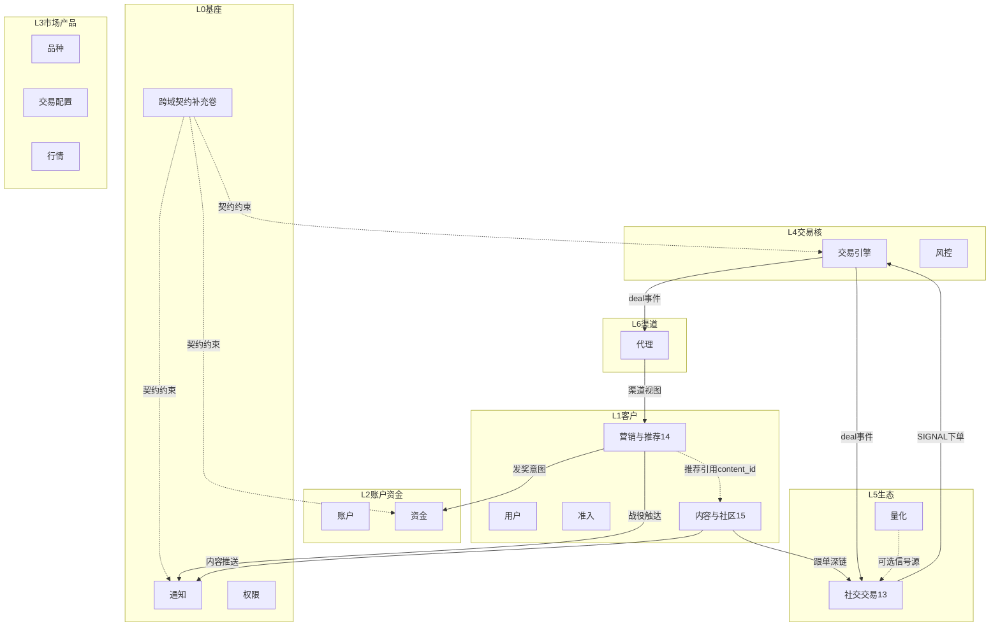

# 经纪平台域地图（完整性目录）

> **版本**：v1.3
> **定位**：全平台业务域归档目录与越界禁令。本文**不是**业务系统，不拥有表结构或运行时权威。
> **原则**：按业务归档，不按页面/功能点拆系统；一域一类权威数据；跨域只走事件/RPC；方向设计不锁定实现语言。
> **范围**：0–15 全部 16 个业务域 + 平台跨域契约补充卷。
> **跨域契约**：遵循《平台跨域契约补充卷》v1.x（错误码/事件/角色/ID/entity_id/灰度/API/容灾/容量/监控的唯一权威源）。

---

## 一、命名对照（易混三项）

| 域编号 | 推荐命名 | 一句话 | 不是什么 |
|--------|----------|--------|----------|
| **13** | **社交交易** | 跟单 Copy + 交易排行榜 | 不是群聊「社区」 |
| **14** | **营销与推荐** | CRM 分群/活动发奖/推荐位 | 不含 IM、不含新闻正文 |
| **15** | **内容与社区** | 资讯 CMS + IM 大厅/广场 | 不含跟单、不含赠金规则 |

> 「社区」只用于 [15] 聊天与内容；「社交」在 [13] 特指跟单执行社交（Social Trading）。

---

## 二、分层总览

> L0–L7 分层的文字定义详见《平台跨域契约补充卷》§2.1（唯一权威）。下方 mermaid 图为域间交互可视化，为本文独有。

---

## 三、全量域清单

| # | 域 | 目录 | 权威数据 | 明确不拥有 |
|---|-----|------|----------|------------|
| 00 | 后台权限 | `[00]后台权限系统` | RBAC/ABAC 授权、SoD、审计、组织主数据 | C 端登录、业务规则 |
| 01 | 准入 | `[01]准入系统` | 申请、KYC、AML、协议、审核任务 | 用户主体、账户、通知送达 |
| 02 | 交易配置 | `[02]交易配置` | 路由规则、时段、杠杆/保证金 | 成交、行情、品种规格 |
| 03 | 通知 | `[03]通知系统` | 事件接入、模板、通道编排、送达 | 活动规则、CMS 正文、IM 会话 |
| 04 | 用户 | `[04]用户体系` | 身份主体、凭证、偏好、设备 | KYC 审核、账户、通知偏好 |
| 05 | 账户 | `[05]账户体系` | 账户主体、账户组、MAM 关系 | 余额写、KYC、品种 |
| 06 | 品种 | `[06]品种体系` | 品种主数据、合约规格、公司行动 | 杠杆值、时段、行情 |
| 07 | 代理 | `[07]代理商分润体系` | 归因、佣金计划、计提、账本、结算 | 客户收费、用户、交易 |
| 08 | 行情 | `[08]行情体系` | 报价处理、Core Book、Client Quote | 品种规格、路由规则 |
| 09 | 资金 | `[09]资金体系` | ledger、冻结、出入金、公司账簿 | 账户主体、交易成交 |
| 10 | 交易 | `[10]交易系统` | Order/Deal/Position、引擎、Outbox | 资金账本、行情、品种 |
| 11 | 风控 | `[11]风控系统` | 规则、Kill Switch、PreTrade、House | 成交写、规则配置持久化 |
| 12 | 量化 | `[12]量化系统设计` | API/SDK、托管 Runtime、回测 | Copy 真相、成交写 |
| 13 | 社交交易 | `[13]跟单与排行系统` | 订阅、Copy 放大、排行榜、分成意图 | IM、CMS、IB 返佣、成交写 |
| 14 | 营销与推荐 | `[14]营销推荐系统` | CRM、活动、推荐、工单 | IM、CMS 正文、跟单 |
| 15 | 内容与社区 | `[15]头条与社区系统` | 资讯/公告、IM 会话消息 | 活动发奖、跟单、CRM 任务 |
| 平台 | 跨域契约 | `[平台]跨域契约补充卷` | 错误码/事件/角色/ID/灰度/容灾/容量/监控 | 业务表结构、运行时权威 |

旧名「客户运营」已拆为 **14 营销与推荐 + 15 内容与社区**（不再保留客户运营目录）。

---

## 四、能力归档

| 能力 | 归档 |
|------|------|
| 跟单 + 交易排行榜 | **13 社交交易** |
| CRM / 赠金活动 / 推荐位 / 工单 | **14 营销与推荐** |
| 新闻头条 / 公告 / 投教 | **15 内容与社区** |
| IM 大厅 / 广场 / 群聊 | **15 内容与社区** |
| 信号源主页轻量评论 | 13（可选）；升级群聊 → 15 |
| 营销短信战役 | 14 编排 + 3 送达 |
| 销售提成 | 14 内部激励；禁入 Partner 账本 |
| 跨域错误码 / 事件 / 角色 / ID | **平台跨域契约补充卷** |
| 灰度 / 容灾 / 容量 / 监控基线 | **平台跨域契约补充卷** |

---

## 五、关键越界禁令

1. 成交只经 Trading Engine。
2. 余额变更只经引擎资金 RPC。
3. 归因只在代理域；营销不得改写。
4. 跟单/排行只在 13。
5. IM 不得自动下单；晒单须授权。
6. 通知不拥有活动规则与文章正文、IM 会话。
7. 方向稿不锁定实现语言。
8. 跨域错误码/事件/角色/ID 不得各域自创，统一引用《平台跨域契约补充卷》。
9. `user_uid` 由用户服务生成；准入不得生成 `trading_user_uid`。
10. `realized_markup_revenue` 由路由网关经 `revenue.realized.v1` 产出，代理域不得自行推算。

---

## 六、主事件一览

跨域事件完整清单、CloudEvents envelope 与关键 payload schema 见《平台跨域契约补充卷》§四（唯一权威源），本文不再重复列举，避免与补充卷产生不同步的两份拷贝。

---

## 七、域成熟度评级（历次修订完成情况）

> 全部 16 域 + 平台契约卷已完成本轮修订，"修订后目标"列即为当前已达成状态；"主要补强"列记录该域本轮修订已交付的核心内容。

| 域 | 修订前 | 修订后（已达成） | 主要补强 |
|----|--------|------------------|----------|
| 00 权限 | A- | A | 组织主数据、服务账号、错误码、灾备 |
| 01 准入 | C+ | A | 架构壳层、状态机、事件契约、API、AML 降级 |
| 02 路由 | B+ | A | 运行时 API、错误码、SLO、重路由状态机 |
| 02 时间 | A- | A | SessionQueryService 契约、预计算幂等 |
| 02 杠杆 | A- | A | Protobuf API、TIERED 例题、SPAN ETL |
| 03 通知 | A | A+ | INBOX WS、错误码、容量、灰度 |
| 04 用户 | C | A | 扩至 1500+，状态机/API/事件/MFA/合规 |
| 05 账户 | B+ | A | can_withdraw、状态机、Account API |
| 06 品种 | B+ | A | 生命周期、公司行动 Saga、事件总线 |
| 07 代理 | A- | A | 事件 Schema、收入事件、OpenAPI |
| 08 行情 | C+ | A | 扩至 1200+，协议 Session、回压、容灾 |
| 09 资金 | A- | A+ | Saga、margin_call_buffer、HTTP API、对账 |
| 10 交易 | A- | A | 错误码、WAL、Mixed、容量（含原独立"撮合引擎"文档，已合并入交易系统设计.md） |
| 11 风控 | A- | A+ | 阈值优先级、Risk Ops API、多实例容灾 |
| 12 量化 | B+ | A | OpenAPI、回测内路径、异常时序 |
| 13 社交 | C | A | 重写：信号映射、滑点、扇出、排行防刷 |
| 14 营销 | D | A | 重写：资格引擎、发奖全链路、推荐冷启动 |
| 15 内容 | D | A | 重写：IM 架构、审核、反垃圾 |
| 平台契约 | — | A | 新增：十大注册表与基线 |

---

## 八、文档索引

| 文档 | 角色 |
|------|------|
| 本文 | 完整性目录 + 域成熟度评级 |
| `[平台]跨域契约补充卷.md` | 跨域契约单一权威源（错误码/事件/角色/ID/灰度/API/容灾/容量/监控） |
| `[00]后台权限系统/权限系统设计-终版.md` | RBAC+ABAC IAM |
| `[01]准入系统/准入系统设计.md` | KYC/AML/开户编排 |
| `[02]交易配置/路由网关/交易配置设计--路由网关.md` | 路由规则与信用 |
| `[02]交易配置/时间配置/交易配置设计--时间设置.md` | 交易时段 |
| `[02]交易配置/杠杆配置/交易配置设计--杠杠与系统最终版.md` | 杠杆/保证金 |
| `[03]通知系统/通知系统设计-终版.md` | 通知编排与送达 |
| `[04]用户体系/用户体系设计.md` | C 端身份中心 |
| `[05]账户体系/账户体系设计.md` | 账户主数据与参数 |
| `[06]品种体系/品种体系设计.md` | 品种主数据 |
| `[07]代理商分润体系/代理系统设计.md` | IB 渠道与佣金 |
| `[08]行情体系/行情系统设计.md` | 报价处理与分发 |
| `[09]资金体系/资金系统设计.md` | ledger 与出入金 |
| `[10]交易系统/交易系统设计.md` | 交易域权威（含撮合引擎运行时，原独立"撮合引擎设计.md"已合并于此） |
| `[11]风控系统/风控系统设计.md` | 风控规则与执行 |
| `[12]量化系统设计/量化系统设计.md` | API/托管/回测 |
| `[13]跟单与排行系统/社交交易系统设计.md` | 跟单 + 排行榜 |
| `[14]营销推荐系统/营销与推荐系统设计.md` | CRM + 活动 + 推荐 |
| `[15]头条与社区系统/内容与社区系统设计.md` | 资讯 + IM |

---

## 九、修订历史

| 版本 | 日期 | 变更 |
|------|------|------|
| v1.0 | 2026-07-14 | 初版：0–12 域归档 |
| v1.1 | 2026-07-20 | 补全 13/14/15 三域命名与能力归档 |
| v1.2 | 2026-07-21 | 引用《平台跨域契约补充卷》；补全域成熟度评级；主事件清单对齐补充卷；L0 增加"跨域契约补充卷"基座；文档索引补全 20 份域稿 |
| v1.3 | 2026-07-22 | 去重：删除与补充卷重复的 L0–L7 分层文字块与主事件表，改为引用补充卷；移除"撮合引擎设计.md"（已合并入交易系统设计.md）失效引用；域成熟度评级表由"待办目标"改为"已完成"状态说明 |

---

## 十、结语

本域地图是 gogo-trade 的"目录页"。各域设计稿是"章节正文"。**《平台跨域契约补充卷》是"宪法"**，约束所有章节的跨域协作。三者共同构成一套完整的、契约严密的、面向世界顶级金融经纪平台的设计体系。

阅读建议：先读本域地图建立全局观 → 读《平台跨域契约补充卷》理解跨域约束 → 按域编号顺序研读各域正文。
