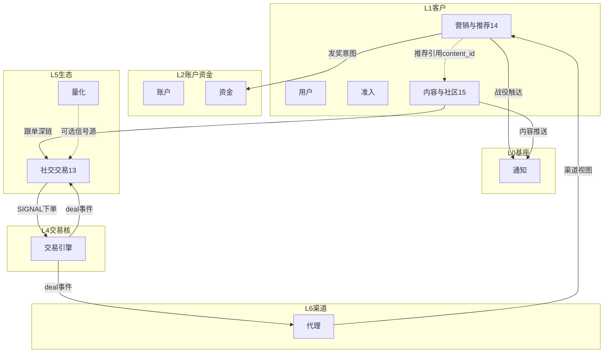

# 经纪平台域地图（完整性目录）

> **版本**：v1.1  
> **定位**：全平台业务域归档目录与越界禁令。本文**不是**业务系统，不拥有表结构或运行时权威。  
> **原则**：按业务归档，不按页面/功能点拆系统；一域一类权威数据；跨域只走事件/RPC；方向设计不锁定实现语言。  
> **范围**：0–12 既有域 + 补全 **13 社交交易 / 14 营销与推荐 / 15 内容与社区**。

---

## 一、命名对照（易混三项）

| 域编号 | 推荐命名 | 一句话 | 不是什么 |
|--------|----------|--------|----------|
| **13** | **社交交易** | 跟单 Copy + 交易排行榜 | 不是群聊「社区」 |
| **14** | **营销与推荐** | CRM 分群/活动发奖/推荐位 | 不含 IM、不含新闻正文 |
| **15** | **内容与社区** | 资讯 CMS + IM 大厅/广场 | 不含跟单、不含赠金规则 |

> 「社区」只用于 [15] 聊天与内容；「社交」在 [13] 特指跟单执行社交（Social Trading）。

---

## 二、分层总览

```text
L0 平台基座     权限 · 通知 · 多实体 · 审计
L1 客户与合规   用户 · 准入/KYC · 营销与推荐 · 内容与社区
L2 账户与资金   账户 · 资金
L3 市场与产品   品种 · 交易配置 · 行情
L4 交易执行核   交易/引擎 · 风控
L5 程序化与生态 量化 · 社交交易(跟单/排行榜)
L6 渠道         代理 IB/Affiliate
L7 只读经营层   结单/BI/监管报送
```



---

## 三、全量域清单（补全段）

| # | 域 | 目录 | 权威数据 | 明确不拥有 |
|---|-----|------|----------|------------|
| … | 0–12 | 既有目录 | （略，见各权威稿） | |
| **13** | **社交交易** | `[13]社交交易` | 订阅、Copy 放大、排行榜、分成意图 | IM、CMS、IB 返佣、成交写 |
| **14** | **营销与推荐** | `[14]营销与推荐` | CRM、活动、推荐、工单 | IM、CMS 正文、跟单 |
| **15** | **内容与社区** | `[15]内容与社区` | 资讯/公告、IM 会话消息 | 活动发奖、跟单、CRM 任务 |

旧名「客户运营」已拆为 **14 营销与推荐 + 15 内容与社区**（不再保留客户运营目录）。

---

## 四、能力归档

| 能力 | 归档 |
|------|------|
| 跟单 + 交易排行榜 | **13 社交交易** |
| CRM / 赠金活动 / 推荐位 / 工单 | **14 营销与推荐** |
| 新闻头条 / 公告 / 投教 | **15 内容与社区** |
| IM 大厅 / 广场 / 群聊 | **15 内容与社区** |
| 信号源主页轻量评论 | 13（可选）；升级群聊 → 15 |
| 营销短信战役 | 14 编排 + 3 送达 |
| 销售提成 | 14 内部激励；禁入 Partner 账本 |

---

## 五、关键越界禁令

1. 成交只经 Trading Engine。  
2. 余额变更只经引擎资金 RPC。  
3. 归因只在代理域；营销不得改写。  
4. 跟单/排行只在 13。  
5. IM 不得自动下单；晒单须授权。  
6. 通知不拥有活动规则与文章正文、IM 会话。  
7. 方向稿不锁定实现语言。

---

## 六、主事件一览（补全段）

| 事件 | 生产方 | 消费方 |
|------|--------|--------|
| `signal.generated` / `copy.*` | 13 | 放大、通知、15 系统卡片 |
| `campaign.*` / `crm.*` / `ticket.*` | 14 | 资金、通知 |
| `content.published.*` | 15 | 通知、App |
| `im.*.flagged` 等 | 15 | 审核台 |

---

## 七、文档索引

| 文档 | 角色 |
|------|------|
| 本文 | 完整性目录 |
| `[13]社交交易/社交交易系统设计.md` | 跟单 + 排行榜 |
| `[14]营销与推荐/营销与推荐系统设计.md` | CRM + 活动 + 推荐 |
| `[15]内容与社区/内容与社区系统设计.md` | 资讯 + IM |
